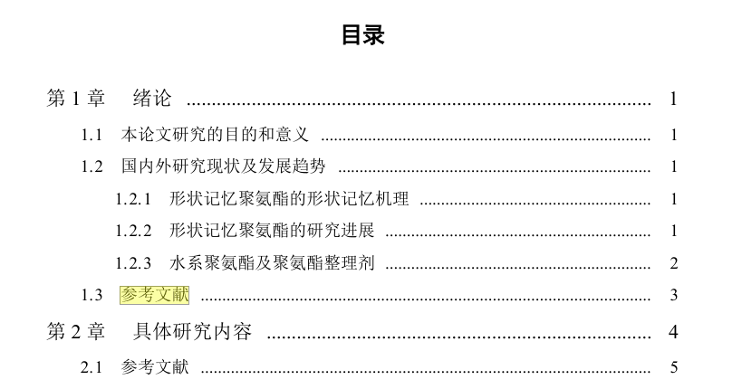
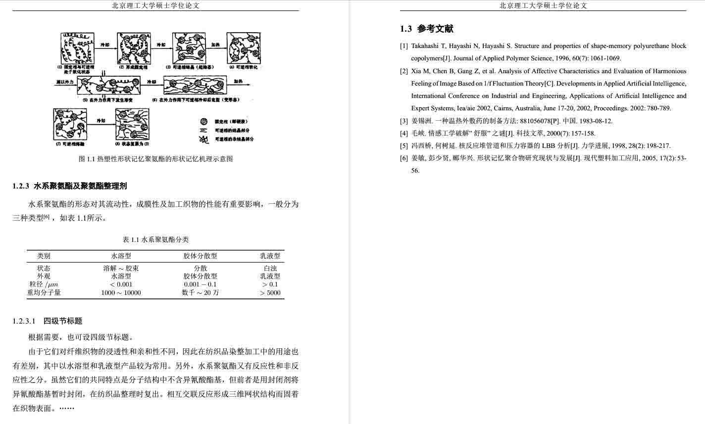

---
tag:
  - biblatex-gb7714-2015
  - bithesis
---

# 参考文献分章

<!-- https://github.com/BITNP/BIThesis/discussions/435 -->

文章较长时，可能想在每一章之后添加参考文献，并不统一甩到最后。

::: details 效果截图


:::

[[pkg:biblatex]]提供了`refsection=chapter`选项自动实现，但[[pkg:bithesis]]间接使用了[[pkg:titletoc]]，会冲突，无效。于是暂时只能手动实现。

## 手动方法

1. 编辑`main.tex`，给每一章套个`refsection`环境，并将原来的`2_reference.tex`移动、复制到每个`refsection`内：

```latex
\mainmatter

% 请根据论文内容，按照顺序添加章节。
\begin{refsection}  % [!code ++]
\input{./chapters/chapter1.tex}
\input{./misc/2_reference.tex}  % [!code ++]
\end{refsection}  % [!code ++]

\begin{refsection}  % [!code ++]
\input{./chapters/chapter2.tex}
\input{./misc/2_reference.tex}  % [!code ++]
\end{refsection}  % [!code ++]

\backmatter

% 结论
\input{./misc/1_conclusion.tex}
% 参考文献  // [!code --]
\input{./misc/2_reference.tex}  % [!code --]
```

解释：biblatex会在每个`refsection`中单独统计参考文献，现在人为每章设置一个`refsection`。

2. 编辑`bithesis.cls`，搜索`bibprint`，往下十几行，把`\chapter`改为`\section`：

```latex
\NewDocumentEnvironment {bibprint} {}
  {
    % …

    \__bithesis_if_thesis_english:TF {
      \chapter{\c__bithesis_label_reference_en_tl}  % [!code --]
      \section{\c__bithesis_label_reference_en_tl}  % [!code ++]
    } {
      \chapter{\c__bithesis_label_reference_tl}  % [!code --]
      \section{\c__bithesis_label_reference_tl}  % [!code ++]
    }
  }
  {}
```

解释：原本参考文献是单独一章（标题居中），现在改为每章的一节（标题居左并编号）。
