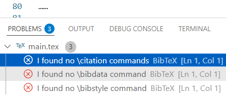

---
tag:
  - meta
  - biblatex-gb7714-2015
  - bithesis
---

# 参考文献空白，BibTeX 报错`I found no \citation commands`（如何换用 biber？）

::: tip 应当无此问题
如果您按照 [📃 编辑器配置与模板编译](../guide/configure-and-compile.md)使用 latexmk、VS Code、TeXstudio 或在线平台，并且没有删除`main.tex`中的魔术注释`% !BIB program = biber`，应当无此问题。

<!-- 已知需专门设置的编辑器：Texmaker -->

:::

## 现象

若出现以下所有现象，很可能是此问题。

- 能生成 PDF，但参考文献

  - 正文引用处显示 key 而非编号
  - 文末著录列表完全空白

- BibTeX 报错`I found no \citation commands`

  

  `main.blg`也有如下内容：

  ```log
  This is BibTeX, Version 0.99d (TeX Live 2025)
  I found no \citation commands---while reading file main.aux
  I found no \bibdata command---while reading file main.aux
  I found no \bibstyle command---while reading file main.aux
  ```

## 应对

**原因**：模板要求用 biber 程序编译，但实际用了 bibtex 程序。

**背景原因**：LaTeX 传统上用 BibTeX 排版参考文献，但这种方法对中文支持差。因此，[[pkg:bithesis]]等国内 LaTeX 模板多用[[pkg:biblatex]]，其默认后端是 biber 程序。

**解决方法**：换用 biber。具体请结合自己的编辑器查询互联网或[人工智能](../guide/ask-computer.md)。
