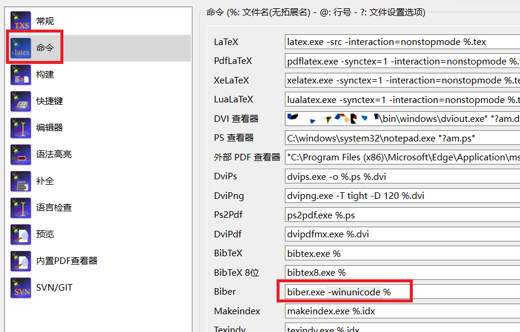

---
tag:
  - meta
  - biblatex-gb7714-2015
---

# 参考文献空白，biber 报错`Can't call method "binmode"`

## 现象

若出现以下所有现象，才可能是此问题。

- 能生成 PDF，但参考文献
  - 正文引用处显示 key 而非编号
  - 文末著录列表完全空白

- biber 报错：

  ```log
  Can't call method "binmode" on an undefined value at C:\Users\中文名\AppData\Local\Temp\par-b2dcbae8eeda\cache-8f3580e5758dcf9e518781a55b95cc7413268871\inc\lib/Biber/Utils.pm line 114.
  ```

- 即使注释掉`main.tex`中所有章节和`*.bib`大部分项目，只保留单个`\cite`，也仍如此

## 应对

**原因**：Windows 用户名有 ASCII 以外的汉字，导致 biber 无法读取缓存。

**背景原因**：biber 是个 perl 程序，perl 缓存在`$env:TEMP`里，`$env:TEMP`默认在用户目录下。

**解决方法**：（任选其一）

- 给 biber 加`-winunicode`选项，修改解码方式。

  ::: details TeXstudio 设置方法

  （顶栏）选项 → 设置 TeXstudio → 命令 → Biber，从`biber.exe %`改成`biber.exe -winunicode %`。

  

  :::

- 修改用户名（记得先备份），或者换其它设备或在线平台。

- 每次使用时在 PowerShell 里设置 `$env:TEMP`到一个纯 ASCII 路径，然后从 shell 里启动 TeXstudio 等编辑器或手动用 latexmk 编译。

  ::: warning 谨慎操作
  如果您头一次听说 shell，建议寻求有经验者帮助。
  :::

::: tip 本问答主要整理于2025年5月

此问题[从 Windows 10 1803 开始出现](https://github.com/plk/biber/issues/369)，以上解决方法针对 biber 2.20（2024年3月发布）测试过。

[2024年10月 biber 改进了解码方式](https://github.com/plk/biber/commit/c8017572331ac55e6ab74553b291a57b1c60efd6)，[2025年7月发布的 biber 2.21](https://github.com/plk/biber/releases/tag/v2.21)可能已修复这个问题。

:::
