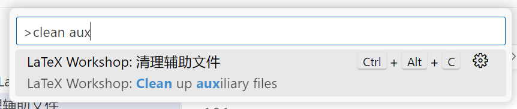

# 如何清除缓存？

编译 LaTeX 时除了生成 PDF，还可能生成`*.aux`等辅助文件和日志。

偶尔先前编译有错，缓存了错误的辅助文件，会导致下一次编译异常。这时可清除缓存从最干净的状态重试。当然，清除缓存也能释放硬盘空间，保持文件整洁。

::: tip 另法
如果您使用终端，也可直接[运行 latexmk](../guide/commands.md#latexmk-c) 删除。
:::

## 使用 VS Code（LaTeX Workshop 插件） {#vscode}

主侧栏 → LaTeX → 构建 LaTeX 项目 → 清理辅助文件。

::: details 该按钮单击后没有反馈，如何确认成功了？

底部面板 → 输出（<kbd>Ctrl</kbd>+<kbd>Shift</kbd>+<kbd>U</kbd>）→ LaTeX Workshop，搜索“clean”。

:::

若找不到按钮，可按<kbd>F1</kbd>直接搜索命令 LaTeX Workshop: Clean up auxiliary files，<kbd>Enter</kbd>。

## 使用 TeXstudio {#texstudio}

顶栏 → 工具 → 清理辅助文件，确定。

## 手动删除

找到`main.tex`所在文件夹，删除与之并列的`main.aux`、`main.bbl`等文件。
