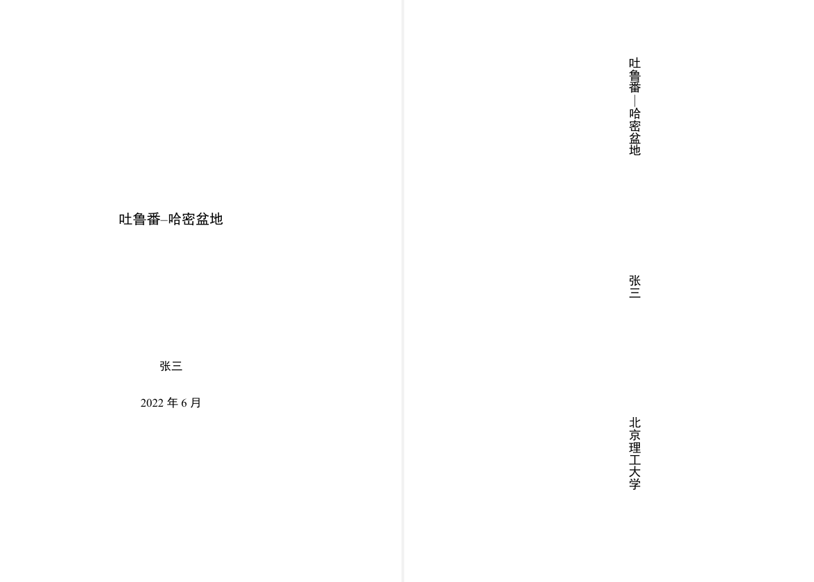

---
tag:
  - bithesis
  - text
---

# 封面竖排标题中的连接号

<!-- https://github.com/BITNP/BIThesis/discussions/446 -->

硕博模板封面中，连接号（短横线、一字线等）在横排标题中要水平，在竖排标题中要竖直。

::: details 效果截图

:::

相关链接：

- [GB/T 15834—2011《标点符号用法》](http://www.moe.gov.cn/jyb_sjzl/ziliao/A19/201001/W020190128580990138234.pdf)

## 暂时解决办法

目前没有特别好的办法，只能用`{\quad}$\mid${\quad}`凑活。

```latex {4}
\BITSetup{
  info = {
    title = {吐鲁番\textendash{}哈密盆地},
    verticalTitle = {吐鲁番{\quad}$\mid${\quad}哈密盆地},
  },
}
```
