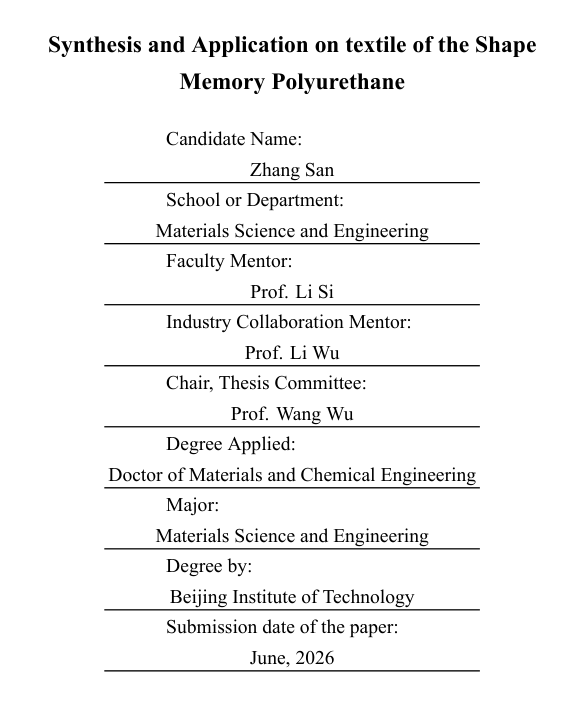
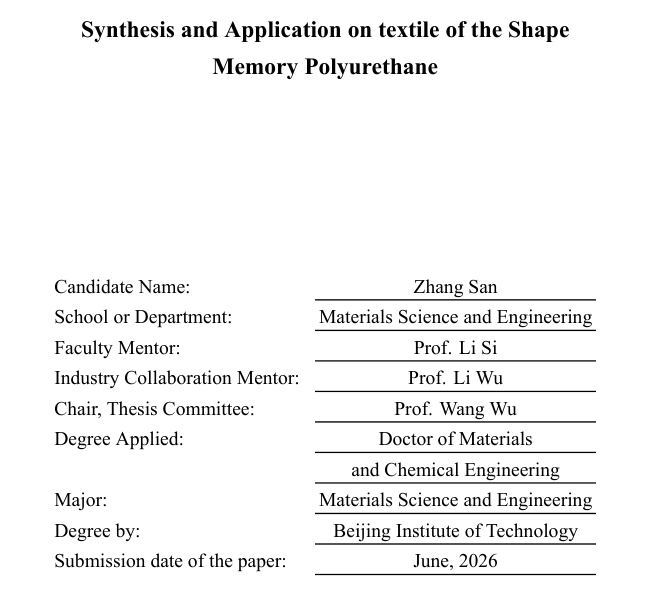

---
tag:
  - bithesis
  - par
---

# 封面个人信息内容太长，溢出一行了怎么办？

## 现象

本科模板的封面、硕博模板中英文题名页会填写个人信息。如果某项内容太长，在一行写不下，模板会生成异常结果并抛出警告。

例如下图，Degree Applied: Doctor of Materials and Chemical Engineering 这项太长，导致行溢出。

::: details 异常结果截图

:::

同时`main.tex`报告以下警告，其中 input line 169 对应绘制封面或题名页的命令（`\MakeCover`或`\MakeTitle`）。

```log
Package bithesis Warning: One or more cover entries are too wide, which may
(bithesis)                result in poor layout.
(bithesis)                To fix it, please split long entries into multiple
(bithesis)                lines by inserting “\\”.
(bithesis)                —The “render-cover-entry/overfull-hbox”
(bithesis)                warning on input line 169.
```

## 解决办法

请编辑`main.tex`，在`\BITSetup{…}`中找到相应字段，用`\\`将长项分成两行，例如：

```latex
degreeEn = {Doctor of Materials and Chemical Engineering}, % [!code --]
degreeEn = {Doctor of Materials \\ and Chemical Engineering}, % [!code ++]
```

::: details 修改结果截图

:::

目前模板不会帮你自动换行，否则封面这些信息容易弄出歧义；还是人工换行比较保险。
