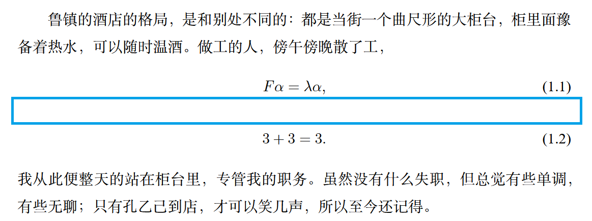
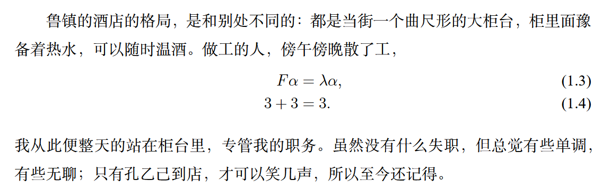

# 两行公式中间怎么有空行？



```latex
\begin{equation}
  F\alpha = \lambda \alpha,
\end{equation}
\begin{equation}
  3+3 = 3.
\end{equation}
```

连写两个`equation`环境，看起来会有空行。

因为中文全是方块字，必须有行距，不然密密麻麻一片；而公式中的字母数字有升降部，即使行距为零，视觉上也有空白。二者排版需要不同，但又共同行文，不得不采用相同行距，于是并置时公式往往显得很空。

## 解决方案

- 在公式之间写些字，比如介绍一下怎么推导的。

- 将连续的多个`equation`换成单个`align`（该环境由[[pkg:amsmath]]提供）：

  ```latex
  \begin{align}
    F\alpha &= \lambda \alpha, \\
    3+3 &= 3.
  \end{align}
  ```

  
