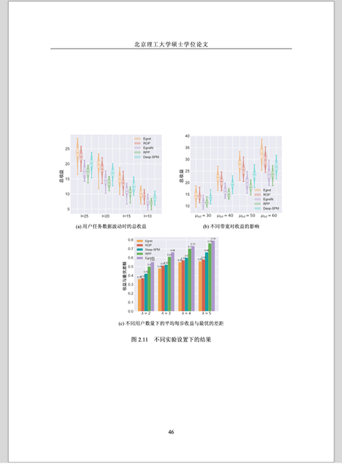

# 某些表和图单独占了一页

<!-- https://github.com/BITNP/BIThesis/discussions/577 -->

有些时候表和图单独占了一页，前后文字直接跳过了，有没有办法让这几页中也有文字？

::: details 情况截图

:::

目前能想到这些方法：

- 前后多写点儿字；或者调整下表和图的的位置，强行让这页塞点字。
- 缩小浮动体内容的尺寸，比如`\includegraphics[width=0.6\textwidth]{…}`。
- 每个子图的宽度改小一些，凑到一行之内。
- 就保持独占整页了，只是想办法更美观，比如增加表格行高、修改子图排列方式，让内容充满整页。

（人工智能还能列出一些方法，但我都没试过，就不抄录了。）
