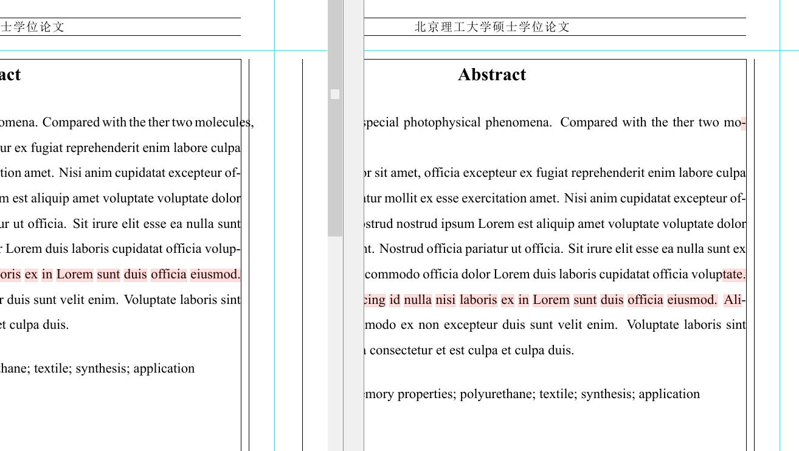
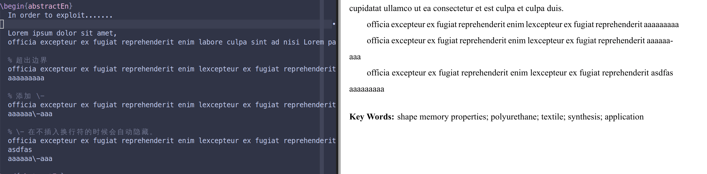

# 控制西文断字

<!-- https://github.com/BITNP/BIThesis/discussions/465#discussioncomment-9177533 -->

::: details 效果截图

希望控制英文摘要中的断字，想下图左→右。

:::

一般情况下，超出该行宽度的最后一个单词会被排版引擎尝试（在适合的地方）插入连字符（hyphen）换行。然而，当单词本身比较生僻的情况下，LaTeX 可能会保留完整单词，从而导致该行宽度绕过限制。

以“aaaaaabbb”为例，有如下两种方法指定插入连字符的位置：

- 设置`\hyphenation{aaaaaa-bbb}`，影响**所有**出现的地方。
- 在正文中使用`aaaaaa\-bbb`，手动指定**这个**单词在`ab`之间换行；如果这里无需换行，则会正常输出`aaaabbbb`。

以上两种方法都能让引擎在 ab 交界处插入连字符，从而正常换行。

