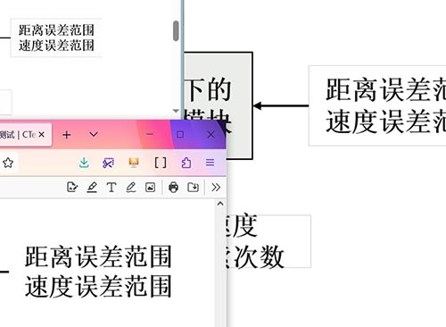

# 有些图片在 Overleaf 上正常，但下载 PDF 后会有灰线？

因为图片本身触发了 PDF 阅读器抗锯齿算法的漏洞，在“白色”与“透明”的交界处会出现灰线。请修改图片，例如把文本框的填充颜色从“白色”改成“无颜色”。

## 具体现象

各种 PDF 阅读器渲染效果不同：

- Firefox 及多数在线平台用的 [PDF.js](https://mozilla.github.io/pdf.js/) 渲染正常。

- Chrome/Edge 和 SumatraPDF 缩小看有灰线，但放大看正常。

Windows 照片会在图片背后垫灰底，用它打开图片，发现部分白色部分透明：

## 原理

> PDF是怎么渲染的？为什么“白色”和“透明”的边界处，缩小看时有线，而放大时没有？

以下是[人工智能的回答](https://yuanbao.tencent.com/bot/app/share/chat/s4IRHpBNNrtf)。

- 缩小视图时

  PDF渲染器会对边缘进行抗锯齿处理，通过插入半透明像素平滑锯齿。当白色（RGB 255, 255, 255）与透明区域（α=0）相邻时，抗锯齿会生成中间灰度的半透明像素（例如：RGB 255, 255, 255，α=128）。这些半透明像素与背景或其他颜色混合后，可能形成一条视觉上的“灰线”（尤其在深色背景下更明显）。

- 放大视图时

  像素级显示时，抗锯齿的中间像素被实际渲染为独立像素，边界清晰可见，不再有模糊的过渡，因此“线”消失。
