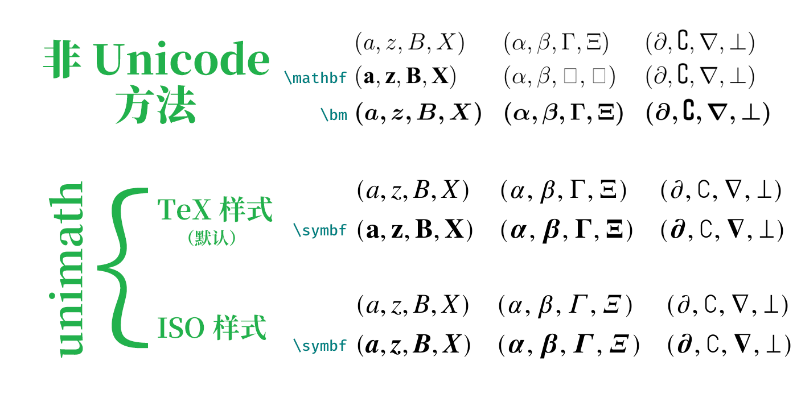

---
tag:
  - font
  - package
---

# 如何修改数学公式的字体？

:::: details 效果对比



- **非 Unicode 方法**

  直接书写、使用原生的`\mathbf`、使用[[pkg:bm]]提供的`\bm`。

- **Unicode 方法**（简称 unimath）

  使用[[pkg:unicode-math]]设置字体为 TeX Gyre Termes Math（具体方法见后）。TeX 样式即默认样式，ISO 样式需手动导入宏包并设置`\unimathsetup{ math-style = ISO, bold-style = ISO }`。

::: details 测试细节

排除字体差异后，非 Unicode 方法和 Unicode 方法的关键区别是映射的字符不同。从 PDF 中复制公式出来，会得到以下这些字符，可以看到只有 Unicode 方法会采用粗体字符。

```
(a, z, B, X) (α, β, Γ, Ξ) (∂, ∁, ∇, ⊥)
(a, z, B, X) (α, β, ?, ?) (∂, ∁, ∇, ⊥)
(a, z, B, X) (α, β, Γ, Ξ) (∂, ∁∁∁, ∇, ⊥)

(𝑎, 𝑧, 𝐵, 𝑋) (𝛼, 𝛽, Γ, Ξ) (𝜕, ∁, ∇, ⟂)
(𝐚, 𝐳, 𝐁, 𝐗) (𝜶, 𝜷, 𝚪, 𝚵) (𝝏, ∁, 𝛁, ⟂)

(𝑎, 𝑧, 𝐵, 𝑋) (𝛼, 𝛽, 𝛤, 𝛯) (𝜕, ∁, ∇, ⟂)
(𝒂, 𝒛, 𝑩, 𝑿) (𝜶, 𝜷, 𝜞, 𝜩) (𝝏, ∁, 𝛁, ⟂)
```

此外，字体缺少字形时（比如加粗`∁`），Unicode 方法会放弃，而[[pkg:bm]]可能通过复制三份叠加来制造字形（所以出现了`∁∁∁`）。

用于测试的具体代码如下，包含大小写拉丁和希腊字母，以及几个特殊符号。

```latex
\begin{equation}
  \begin{aligned}
  & (a, z, B, X) && (\alpha, \beta, \Gamma, \Xi) && (\partial, \complement, \nabla, \perp) \\
  & \symbf{(a, z, B, X)} && \symbf{(\alpha, \beta, \Gamma, \Xi)} && \symbf{(\partial, \complement, \nabla, \perp)}
  % & \mathbf{(a, z, B, X)} && \mathbf{(\alpha, \beta, \Gamma, \Xi)} && \mathbf{(\partial, \complement, \nabla, \perp)} \\
  % & \bm{(a, z, B, X)} && \bm{(\alpha, \beta, \Gamma, \Xi)} && \bm{(\partial, \complement, \nabla, \perp)}
  \end{aligned}
\end{equation}
```

:::

::::

## BIThesis

请编辑`main.tex`，用`\BITSetup`设置`style/mathFont`选项，例如：

```latex {4}
\BITSetup{
  …,
  style = {
    mathFont = termes,
  },
}
```

这里`terms`指 TeX Gyre Termes Math 字体，它相当接近 Times New Roman。

::: details 二者可见区别
Termes 的斜体`𝑧`和粗斜体`𝒛`最后一笔都是弯的（弯的样子参考上面的效果对比），而 Times 只有粗斜体`𝒛`如此，普通斜体`𝑧`则是直的。

以下设置能混合两种字体，让斜体使用 Times；不过数学字体的细节对于学位论文并不重要，而且这种设置方法还会导致 Times 缺少的`∂`等字符无法显示，所以非常不建议使用。

```latex
\usepackage{unicode-math}
\setmathfont{texgyretermes-math.otf}
\setmathfont[range=it]{timesi.ttf} % 把斜体替换为 Times，但非常不建议 ⛔
```

:::

更多字体选择请参考[[texdoc:bithesis]]。

::: tip 📥 报错 font cannot be found？请补装字体

> ! Package fontspec Error:
>
> The font "texgyretermes-math" cannot be found; this may be but usually is not a fontspec bug.
> Either there is a typo in the font name/file, the font is not installed (correctly), or there is a
> bug in the underlying font loading engine (XeTeX/luaotfload).

如果您之前精简了 TeX Live 安装内容，报告以上错误，那么需要补装字体：

```shell
tlmgr install tex-gyre-math
```

:::

## 一般 LaTeX 文档

<!-- https://github.com/BITNP/BIThesis/discussions/583 -->

可以在导言区引入[[pkg:unicode-math]]，并使用 `\setmathfont{…}` 修改数学环境下字体，例如：

```latex
\usepackage{unicode-math}
\unimathsetup{
  math-style = ISO,
  bold-style = ISO,
}
\setmathfont{XITSMath-Regular.otf}
```

（部分环境需手动安装字体）

更多字体与使用方法请参考[[texdoc:unicode-math]]。

## 可能存在的问题

### 粗体：`\boldsymbol` → `\symbf`

[[pkg:unicode]]与上世纪的字体管理方式不兼容。使用[[pkg:unicode]]后，加粗无法使用[[pkg:amsbsy]]的`\boldsymbol`、[[pkg:bm]]的`\bm`、[[pkg:physics]]的`\vb`等。

建议使用`\symbf`加粗，`\symup`、`\symit`、`\symcal`等同理。

::: details 另法：采用兼容手段

也可以考虑兼容手段，例如使用[[pkg:physics2]]的`bm-um.legacy`，或者自己[`\renewcommand*`](https://texfaq.org/FAQ-newcmdstar)：

```latex
% Overwrite some commands from physics to be compatible with unicode-math
\RenewCommandCopy\vb\symbf
\renewcommand*{\vdot}{\symbf{\cdot}}
\renewcommand*{\grad}{\symbf{\nabla}}
\renewcommand*{\divergence}{\symbf{\nabla} \vdot}
```

:::

参考：[LaTeX 排版国标样式的数学符号 - LaTeX工作室](https://www.latexstudio.net/archives/51494)。

### 如需兼容[[pkg:mathtools]]

[[pkg:mathtools]]提供了`gather`环境、`\coloneqq`符号（:=）等命令，但个别命令与[[pkg:unicode-math]]冲突。如需使用，可在导入时关闭警告：

```latex {5}
% 注意导入顺序
\usepackage{amsmath}
\usepackage{mathtools}
\usepackage[
  warnings-off={mathtools-colon, mathtools-overbracket},
]{unicode-math}

\unimathsetup{…}
```

### 字体字面较大

如果使用 TeX Gyre Pagella Math 等字面较大的字体，略微增加数学行距可能更美观：

```latex
\setmathfont{texgyrepagella-math.otf}
\SetMathEnvironmentSinglespace{1.05}
```

请参考[[texdoc:zhlineskip]]。

### 混用字体

下例中，主要使用 Latin Modern Math，双线体（如 ℕℤℚℝℂ）使用 TeX Gyre Pagella Math，[空集符号 ∅ 使用 Asana Math](https://tex.stackexchange.com/questions/208014/empty-set-symbols-confused)。

```latex
\setmathfont{latinmodern-math.otf}
\setmathfont[range=\mathbb]{texgyrepagella-math.otf}
\setmathfont[range=\varnothing]{Asana-Math.otf}
```

详情请参考[[texdoc:unicode-math]]。
