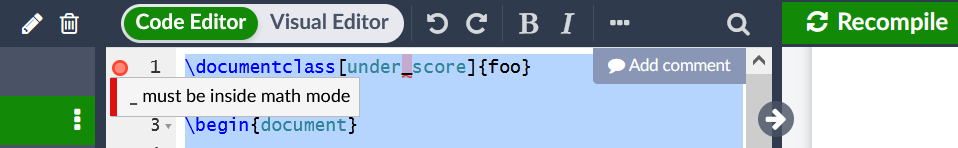

# Overleaf 语法检查器报假错

<!--
  https://github.com/BITNP/BIThesis/discussions/402
  https://github.com/overleaf/overleaf/issues/1185
-->

[Overleaf 内置了 Code Check 语法检查器](https://www.overleaf.com/learn/how-to/Code_Check)，它会在编辑区域左侧报告错误。不过有时错误并不存在，忽略即可。（若确实无法编译，应查看界面右边的日志。）



如果看着烦，也可以[关闭 Code Check](https://www.overleaf.com/learn/how-to/Code_Check#Disabling_Code_Check_for_part_of_a_file)：

```latex
%%begin novalidate  // [!code focus]
\documentclass[under_score]{foo}
%%end novalidate  // [!code focus]
```

## 会报假错的已知例子

```latex
\documentclass[type=bachelor_translation]{bithesis}
```

> `_` must be inside math mode

```latex
\documentclass[…, ctex={fontset=windows}]{bithesis}
```

> invalid documentclass option: unexpected close group `}`
