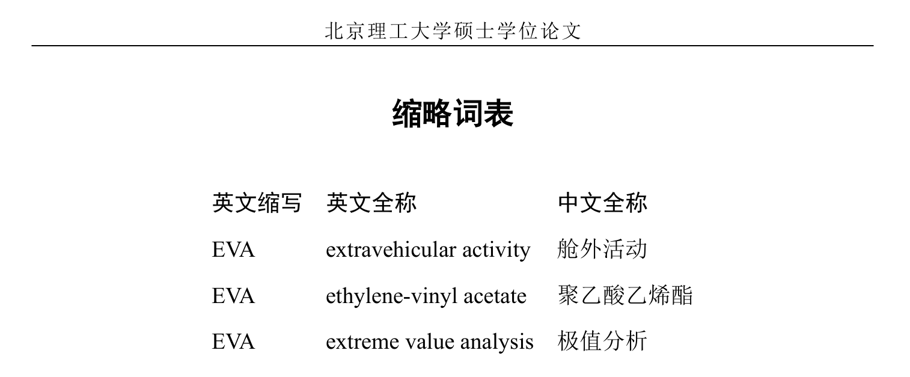

# 如何构造「缩略词表」？（替代`symbols`环境）

<!-- https://github.com/BITNP/BIThesis/discussions/574 -->

硕博模板的`symbols`环境实现了「主要符号对照表」，那么怎样构造「缩略词表」？



[「主要符号对照表」的实现很简单](https://github.com/BITNP/BIThesis/blob/eb2b93d358eda69cbdb0e6dced1d80c53d8958b4/bithesis.dtx#L3318-L3347)，并不支持改成三列的「缩略词表」。

如果想要「缩略词表」，可以编辑`misc/0_symbols.tex`，直接写表格：

```latex {15-18}
\chapter*{缩略词表}  % 星号表示不写入目录
\currentpdfbookmark{缩略词表}{ch:acronym}  % 但仍加入PDF书签（详见hyperref手册）

\vspace{-1ex} % 在竖直方向略微删除空白

\begin{center}
  \BITSetup{
    misc = {
        tabularFontSize = -4, % 字号从五号恢复为小四
        tabularRowSeparation = 1.1, % 各行之间的距离设为默认的 1.1 倍
      },
  }

  \begin{tabular}{lll} % 三列都左对齐
    \textbf{英文缩写} & \textbf{英文全称}           & \textbf{中文全称} \\
    EVA           & extravehicular activity & 舱外活动          \\
    EVA           & ethylene-vinyl acetate  & 聚乙酸乙烯酯        \\
    EVA           & extreme value analysis  & 极值分析          \\
  \end{tabular}
\end{center}

\clearpage
```

顺便，如需表格生成器，可参考 [LaTeX 学习与使用资源](../guide/resources.md#基础)。

::: tip 欢迎反馈
如果你的「缩略词表」是统一要求，有具体规范，欢迎[反馈](https://github.com/BITNP/BIThesis/issues/new)。之后可以加到模板里。
:::
