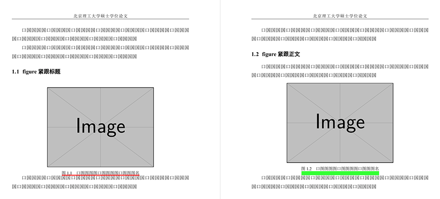

---
tag:
  - bithesis
  - par
---

# 硕博模板图表上下间距异常，怎么办？

<!-- https://github.com/BITNP/BIThesis/issues/584 -->

使用 BIThesis 硕博模板时，有些图表与周围正文的竖直间距明显比其它的窄。

例如下图，右页 figure 的 caption 与其后文的竖直间距（绿色矩形的高度）比较正常，但左页这一间距（红线的宽度）就非常窄，甚至小于正文行距，很不合适。

::: details 异常与正常间距对比截图

:::

<!--
为方便日后更新，记一下生成上图的代码。

```latex
\documentclass[type=master, twoside=false]{bithesis}
\usepackage{mwe}
\usepackage{graphicx}

\begin{document}
\frontmatter
\mainmatter
\chapter{}
\newpage

口国国国国口国国国国口国国国国口国国国国口国国国国口国国国国口国国国国口国国国国口国国国国口国国国国口国国国国口国国国国

口国国国国口国国国国口国国国国口国国国国口国国国国口国国国国口国国国国口国国国国口国国国国口国国国国口国国国国口国国国国

\section{figure紧跟标题}

\begin{figure}[h]
  \centering
  \includegraphics[width=0.6\textwidth]{example-image}
  \caption{口图图图图口图图图图口图图图名}
\end{figure}

口国国国国口国国国国口国国国国口国国国国口国国国国口国国国国口国国国国口国国国国口国国国国口国国国国口国国国国口国国国国

\newpage

口国国国国口国国国国口国国国国口国国国国口国国国国口国国国国口国国国国口国国国国口国国国国口国国国国口国国国国口国国国国

\section{figure紧跟正文}

口国国国国口国国国国口国国国国口国国国国口国国国国口国国国国口国国国国口国国国国口国国国国口国国国国口国国国国口国国国国

\begin{figure}[h]
  \centering
  \includegraphics[width=0.6\textwidth]{example-image}
  \caption{口图图图图口图图图图口图图图名}
\end{figure}

口国国国国口国国国国口国国国国口国国国国口国国国国口国国国国口国国国国口国国国国口国国国国口国国国国口国国国国口国国国国

\end{document}
```
-->

这一问题涉及多个宏包，成因复杂。以下列出了几种解决办法。建议从前到后尝试，必要时可以混合使用。

如果试完仍未解决，或有新情况想反馈，欢迎创建 issue/discussion 或加群讨论。链接见页面上方。

## 修复 CTeX 的缺陷

> 此法影响全文，且理论上能根治。

BIThesis 设置了许多 CTeX 选项，其中之一会触发 ctex v2.6.5 2026-08-15 及更早版本的一个缺陷（[ctex-kit#1100](https://github.com/CTeX-org/ctex-kit/issues/1100 'ctex: 设置`fixskip=true`时，caption下方与正文的间距不统一 · Issue #1100 · CTeX-org/ctex-kit')）。

如果有条件升级宏包，请升级到 [ctex v2.6.6-rc1](https://github.com/CTeX-org/ctex-kit/releases/tag/ctex-v2.6.6-rc1) 或更新版本。
<!-- TODO: 待 ctex v2.6.6 发布到 CTAN 后，给出更明确的指引。 -->

如果没有条件，请在导言区添加以下代码。不过这段代码只针对 ctex v2.6.5 简单测试过，不排除存在副作用，欢迎反馈。

```latex
% 保存 fixskip 覆写前的 \prevdepth。浮动体环境开始时，若发现 \prevdepth < 0 pt，则恢复
\usepackage{etoolbox} % BIThesis 已导入，可省略
\ExplSyntaxOn
\makeatletter
\dim_new:N \l__ctex_fixskip_prevdepth_dim
\pretocmd\CTEX@fixheadingskip
  { \dim_set_eq:NN \l__ctex_fixskip_prevdepth_dim \tex_prevdepth:D }
  { }
  { }
\AtBeginEnvironment { figure }
  { \ifvmode { \ifdim \tex_prevdepth:D < 0pt \dim_set_eq:NN \tex_prevdepth:D \l__ctex_fixskip_prevdepth_dim \fi } \else: { } \fi: }
\makeatother
\ExplSyntaxOff
```

## 统一加宽间距

> 此法影响全文，但只是绕开问题。

加宽间距时，间距异常时的变化量大致保持不变，所以加宽后异常情况就不那么明显了。

::: details 关于明显程度的历史经验

其实本科、硕博模板历史上一直都存在图表上下间距异常问题，但只有 [v3.8.2 2025-03-25](https://github.com/BITNP/BIThesis/releases/v3.8.2) 及之后的硕博模板收到过此类反馈。

- 本科要求图表上下「空一行」，相当于间距很宽，所以变窄一些也看不出来。
- 硕博要求的间距较窄（段前6磅，段后6磅），但硕博模板最初照搬了本科设置，所以当时只偶尔有人反馈间距过宽，并无人反馈全文各处间距不统一。后来 v3.8.2 参照规定改窄了硕博模板的间距，才有人反馈间距有时变得特别窄。

注：不建议回退 BIThesis 到 v3.8.2 或更早版本，因为研究生院后来更新了《撰写规范》，旧版 BIThesis 并不符合新要求。就图表上下间距而言，回退版本与按下文加宽间距的效果基本一样。

:::

请在导言区或正文任意地方添加以下代码，这会加宽其后所有 figure 下方的间距。（BIThesis 硕博模板原本设置为`-12pt`，所以改为`0pt`会变宽。）

```latex
\captionsetup[figure]{belowskip = 0pt}
```

## 逐一调整间距

> 此法只影响局部。最好先尝试上面影响全文的办法，仍未解决再尝试此法。

建议全文完成后，从每章开头依次手动调整，比如前后调换插图、正文的顺序，或者像下面这样加`\vspace{…}`。

```latex
\vspace{-5pt} % [!code highlight]
\begin{figure}[hbt]
 \centering
 \includegraphics[width=0.75\textwidth]{figures/figure1}
 \caption{热塑性形状记忆聚氨酯的形状记忆机理示意图}\label{fig:diagram}
\end{figure}
\vspace{8pt} % [!code highlight]
```

如果嫌麻烦，可让 AI/LLM/agent 调用`pdftotext -bbox`获取文本的边界框并相应调整。
