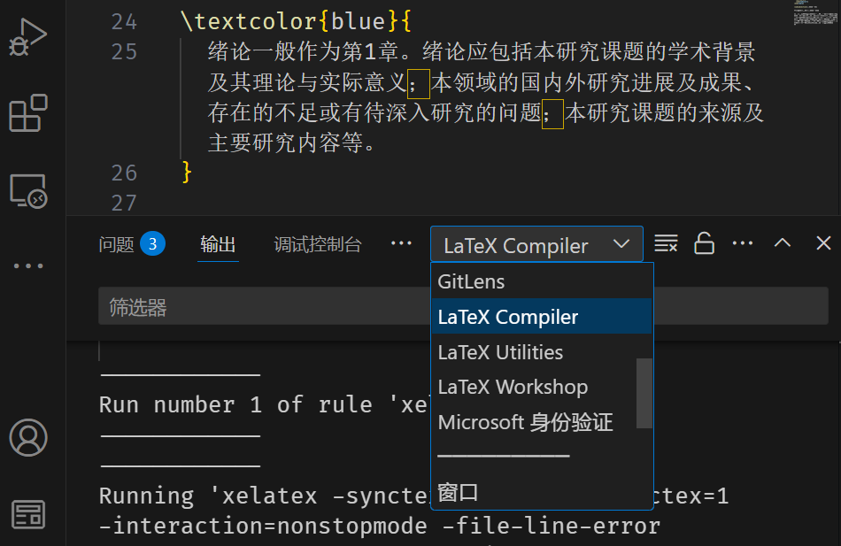

# VS Code 中如何查看日志？

::: tip ⚙ 初次使用时的配置

初次使用时，请参考 [📃 编辑器配置与模板编译：使用 VS Code 配合 LaTeX Workshop 编写与编译](../guide/configure-and-compile.md#使用-vs-code-撰写与编译-latex-模板)。
:::

底部面板 → 输出（<kbd>Ctrl</kbd>+<kbd>Shift</kbd>+<kbd>U</kbd>）→ LaTeX Compiler。

此外，可按<kbd>Ctrl</kbd>+<kbd>F</kbd>搜索日志。
