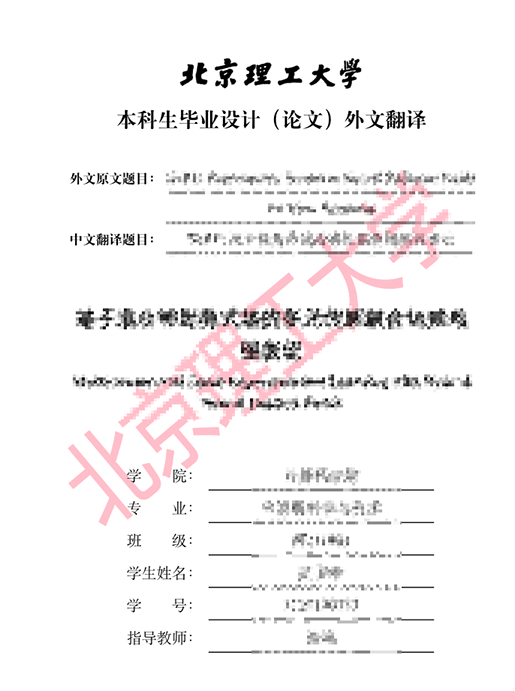
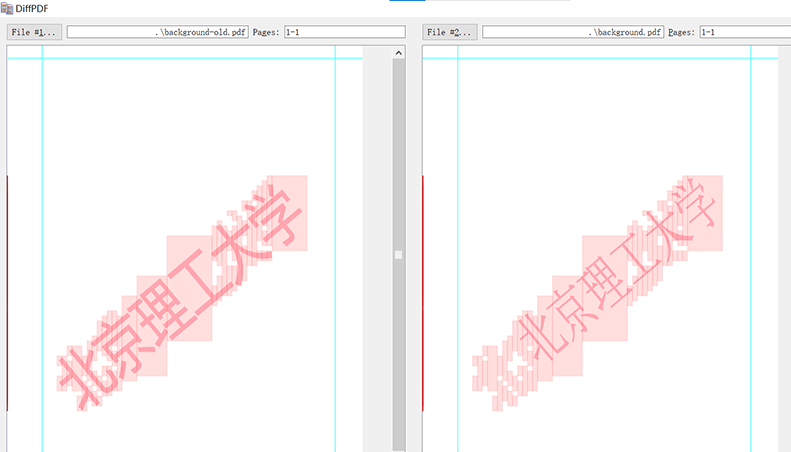

# 如何添加“北京理工大学”水印

<!--
  https://github.com/BITNP/BIThesis/issues/350#issuecomment-1565974141
  https://github.com/BITNP/BIThesis/discussions/531
-->

计算机学院要求本科毕业设计必须有“北京理工大学”水印，添加方法如下。

::: details 效果截图

:::

1. **下载水印底图`background.pdf`，保存到`images/`目录，并重命名为`background.pdf`**

   知网毕设系统会导出 Word 和 PDF，二者水印不一样。可任选一种下载：[Word 效果底图](/assets/watermark/background-word.pdf)、[PDF 效果底图](/assets/watermark/background-pdf.pdf)。

   ::: details 两种底图的区别

   - 左：Word效果——编辑系统导出的 Word，再导出 PDF 得到。
   - 右：PDF效果——直接编辑系统导出的 PDF 得到。

   

   :::

2. **编辑`main.tex`**

   ```latex {1-8,12}
   \newcommand\BackgroundPicture{%
     \put(0,0){%
       \parbox[b][\paperheight]{\paperwidth}{%
         \vfill
         \centering%
         \includegraphics[width=\paperwidth]{images/background.pdf}
         \vfill
       }}}

   % 文档开始
   \begin{document}
   \AddToShipoutPicture{\BackgroundPicture}
   …
   ```

   如需进一步调整水印透明度，可参考：[graphics - Includegraphics: set image opacity - TeX - LaTeX Stack Exchange](https://tex.stackexchange.com/questions/86500/includegraphics-set-image-opacity)。

3. **重新编译**

## 另法：直接操作 PDF

上述方法重新编译原有LaTeX项目，这种方法直接操作既有的`old.pdf`。

1. 同上下载水印底图`background.pdf`

2. 保存以下内容为`main.tex`

   ```latex
   % !TeX program = xelatex
   \documentclass{bithesis} % 需要用 bithesis 修改页面尺寸

   \usepackage{pdfpages}

   \newcommand\BackgroundPicture{%
     \put(0,0){%
       \parbox[b][\paperheight]{\paperwidth}{%
         \vfill
         \centering%
         \includegraphics[width=\paperwidth]{images/background.pdf}
         \vfill
       }}}

   \begin{document}

   \AddToShipoutPicture{\BackgroundPicture}
   \includepdf[pages=-]{old.pdf}

   \end{document}
   ```

3. 编译`main.tex`
