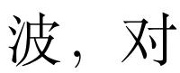
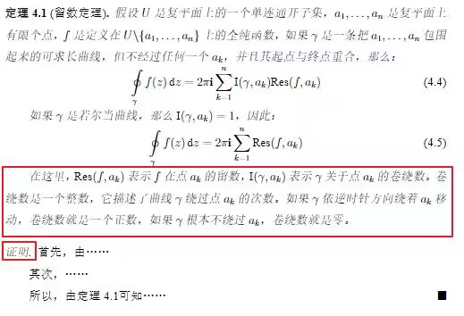
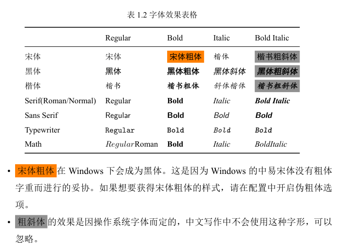

---
tag:
  - font
  - bithesis
---

# 字体奇怪：逗号不像宋体、定理环境中汉字倾斜……

<!-- https://github.com/BITNP/BIThesis/discussions/447 -->

如果您遇到以下任何现象，请参考[如何换用中易字库](./word-font.md)。

- [逗号不像宋体](https://ask.latexstudio.net/ask/question/8035.html)

  

- [[pkg:bithesis]]的`them`定理环境中汉字倾斜

  （正常情况：楷体）

  

::: details 如需确认问题，可加入字体测试表格

在文档中加入下面这段，编译，正常效果如图。

```latex
\begin{table}[htb]
    \linespread{1.5}
    \zihao{5}
    \centering
    \caption{字体效果表格}
    \begin{tabular}{@{}lllll@{}}
               & Regular & Bold & Italic & Bold Italic \\ \hline
      宋体       & 宋体      & \textbf{宋体粗体} & \textit{楷体}     &   \textbf{\textit{楷书粗斜体}}  \\
      黑体         & {\heiti{}黑体}      & \textbf{\heiti{}黑体粗体} &   \textit{\heiti{}黑体斜体}     & \textit{\textbf{\heiti{}黑体粗斜体}}   \\
      楷体         & {\kaishu{}楷书}      & \textbf{\kaishu{}楷书粗体} & \textit{\kaishu{}斜体楷体} &  \textbf{\textit{\kaishu{}楷书粗斜体}}    \\
    \end{tabular}
\end{table}
```



如果以上测试不够，还可使用[完整版](https://github.com/BITNP/BIThesis/blob/66c063676db20d7b040777e994f8ab0e8643a033/templates/undergraduate-thesis/chapters/1_chapter1.tex#L83-L107)。

:::
