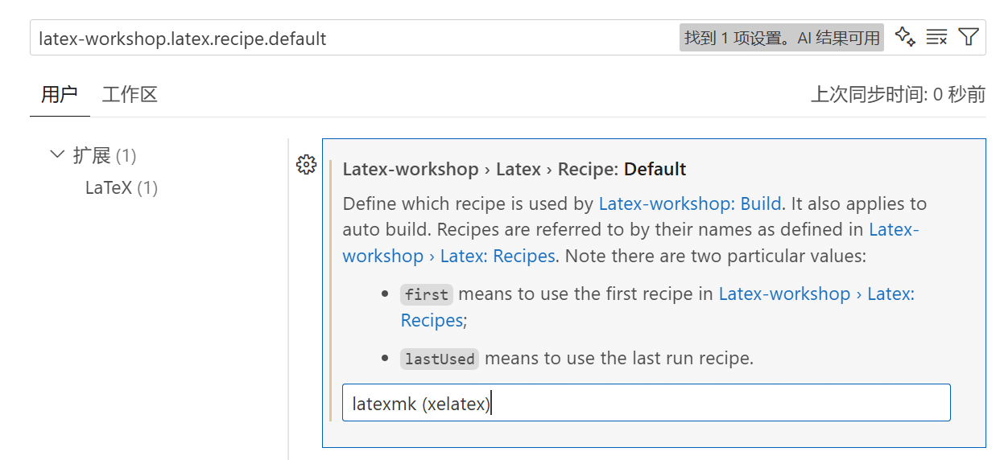
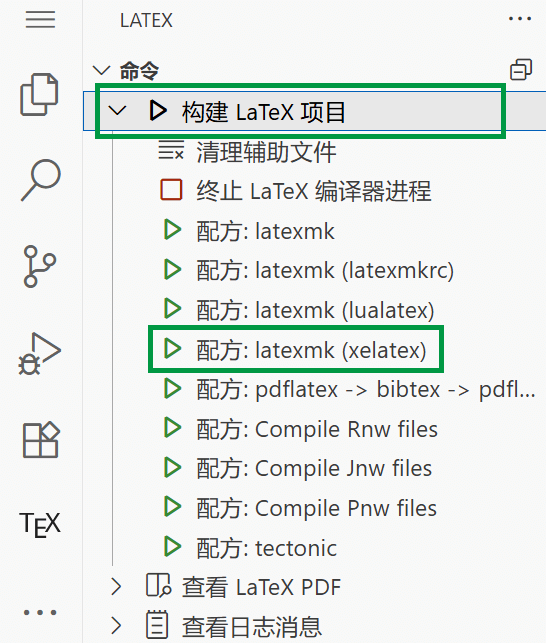

# 📃 编辑器配置与模板编译

## 编译模板

与 Word 不同的是，LaTeX 模板需要我们用合适的工具进行编译，才能生成最终 PDF 文件。我们接下来介绍 BIThesis 中的模板在各个编辑器中的编译方法。

BIThesis 中的模板编译方式大同小异，我们都会使用 `xelatex`、`biber` 以及 `latexmk` 等工具来编译它们。编译 BIThesis 有两种方法：

- 直接使用 `latexmk` 进行编译：只需要使用一次 `latexmk` 即可编译整个模板，自动识别中文环境与参考文献编译器，增量编译（推荐使用，编译比较方便快速 🚀）
- 使用 `xelatex` 配合 `biber` 进行编译：需要使用「四步走」`xelatex -> biber -> xelatex -> xelatex` 的编译顺序编译模板，全量编译（编译一次可能花费较长时间 🐌）

这两种编译方式均可以用于编译我们的模板，大家可以综合自己的使用习惯来挑选工具。事实上，后面我们将要介绍的 LaTeX 编辑器，它们背后所使用的编译方法就是运行这里提到的两种编译工具。只是我们需要单独配置编辑器的编译方法，才能让编辑器正确的调用编译方式，编译我们的 LaTeX 文档。

在这里，我挑选了三种常见的 LaTeX 编写环境：

- [直接使用「命令行」徒手编写编译](#徒手编译)
- [使用 VS Code 配合 LaTeX Workshop 编写与编译](#使用-vs-code-撰写与编译-latex-模板)
- [使用 TeXstudio 编写与编译](#使用-texstudio-撰写与编译-latex-模板)

我会依次介绍在这三种环境下 LaTeX 编译器配置方法。

### 徒手编译

> 这里推荐作为其余方式遇到问题时的调试手段。

当然，你完全可以不借助任何编辑器，直接使用「命令行」编译 LaTeX 文档。

#### 使用 `latexmk` 编译

如果你使用 `latexmk` 编译模板，那么你只需要使用如下的命令即可编译主文件为 `main.tex` 的 LaTeX 项目：

```bash
# 只需要调用一次 latexmk 工具即可
latexmk
```

编译 LaTeX 文档原本需要多步，但 latexmk 会自动按当前情况调用相关工具，既保证文档编译完全，又尽量跳过已完成步骤。因此，仅调用一次 latexmk 即可。

#### 使用 `xelatex` 编译

如果你使用 `xelatex` 编译项目，那么你需要按照下面四步串联顺序调用 `xelatex` 与 `biber` 命令行工具：


比如，编译主文档为 `main.tex` 的 LaTeX 项目，我们具体的命令为：

```bash
# 第一步 xelatex
xelatex -no-pdf --interaction=nonstopmode main
# 第二步 biber
biber main
# 第三步 xelatex
xelatex -no-pdf --interaction=nonstopmode main
# 第四步 xelatex
xelatex --interaction=nonstopmode main
```

### 使用 VS Code 撰写与编译 LaTeX 模板

:::warning 务必修改设置
LaTeX Workshop 默认设置无法编译大部分中文 LaTeX 文档，包括 BIThesis。

请务必按以下修改设置。
:::

<!-- prettier-ignore-start -->
<!-- 以下 vscode:// 链接的 target="_self" 会被 prettier 错误转义，不可自动格式化 -->

1. 安装 [LaTeX Workshop 插件](https://marketplace.visualstudio.com/items?itemName=James-Yu.latex-workshop)。

2. 将设置[`latex-workshop.latex.recipe.default`](vscode://settings/latex-workshop.latex.recipe.default){ target="_self" }从默认的`first`改为`latexmk (xelatex)`。

   

<!-- prettier-ignore-end -->

以后编译文档时，请打开`main.tex`所在文件夹（工作区），按默认方式“构建 LaTeX 项目”（快捷键：<kbd>Ctrl</kbd>+<kbd>Alt</kbd>+<kbd>B</kbd>），或者选择“配方: latexmk (xelatex)”；选择其它配方通常无法编译。

<figure>
  
</figure>

:::: details 报错 Failed to resolve: latexmk (xelatex) 或 Skipping undefined tool xelatexmk？ { style="border-color: var(--vp-custom-block-tip-border); color: var(--vp-custom-block-tip-text); background-color: var(--vp-custom-block-tip-bg);" }

> - [Builder] Failed to resolve build recipe: latexmk (xelatex).
> - Skipping undefined tool "xelatexmk" in recipe "latexmk (xelatex)."

如果打开`main.tex`编译时 LaTeX Workshop 报告以上错误之一，说明你之前修改过设置，覆盖了插件内置的`latexmk (xelatex)`配方或`xelatexmk`工具。

受影响的设置有两项：

- “编译**配方**” `"latex-workshop.latex.recipes": […]`——定义编译整个文档的工具链。编译 LaTeX 文档[可能需要多步](#使用-xelatex-编译)，工具链是指调用工具的范围和顺序。
- “编译**工具**” `"latex-workshop.latex.tools": […]`——定义调用每种工具时执行的具体命令，例如传给 `latexmk` 或 `xelatex` 的参数。

::: details 这些设置在哪里？
在 VS Code 中打开 UI 设置界面（快捷键：`ctrl/cmd + ,` ），单击右上角  按钮打开 JSON 格式设置`settings.json`，搜索（快捷键：`ctrl/cmd + F`）`latex-workshop.latex`。
:::

你可以把之前的设置注释掉（快捷键：<kbd>Ctrl</kbd>+<kbd>/</kbd>），或者如下自行复刻 LaTeX Workshop 的默认配方。

::: details 复刻默认配方
参考 LaTeX Workshop 代码仓库`package.json`中[配方](https://github.com/James-Yu/LaTeX-Workshop/blob/62dc3c812554e6fddd88c27eaf06df7d68716d9e/package.json#L998-L1003)、[工具](https://github.com/James-Yu/LaTeX-Workshop/blob/62dc3c812554e6fddd88c27eaf06df7d68716d9e/package.json#L1104-L1116)的默认值，在自己的`settings.json`中补充以下内容。

```json
"latex-workshop.latex.recipes": [
  {
    "name": "latexmk (xelatex)",
    "tools": [
      "xelatexmk"
    ]
  },
],
"latex-workshop.latex.tools": [
  {
    "name": "xelatexmk",
    "command": "latexmk",
    "args": [
      "-synctex=1",
      "-interaction=nonstopmode",
      "-file-line-error",
      "-xelatex",
      "-outdir=%OUTDIR%",
      "%DOC%"
    ],
    "env": {}
  },
],
```

:::

::::

::: details 单击按钮没有反应？

正常来讲，单击编译按钮后，底部状态栏左侧会用🔁提示进度，或者至少弹出报错信息。

<!-- prettier-ignore-start -->
<!-- 以下 vscode:// 链接的 target="_self" 会被 prettier 错误转义，不可自动格式化 -->
若完全没有反应，可能是因为屏蔽了报错。请启用[`latex-workshop.message.error.show`](vscode://settings/latex-workshop.message.error.show){ target="_self" }设置重试。
<!-- prettier-ignore-end -->

:::

:::: details 还有特殊需要？

<!-- prettier-ignore-start -->
<!-- 以下 vscode:// 链接的 target="_self" 会被 prettier 错误转义，不可自动格式化 -->

- **不想频繁擦写硬盘？**

  将[`latex-workshop.latex.autoBuild.run`](vscode://settings/latex-workshop.latex.autoBuild.run){ target="_self" }从默认的`onFileChange`改为`never`，然后按<kbd>Ctrl</kbd>+<kbd>Alt</kbd>+<kbd>B</kbd>编译。

- **想用 [SumatraPDF](https://www.sumatrapdfreader.org) 替代 VS Code 查看 PDF？**

  参考 [forward inverse search - VS Code & SumatraPDF InverseSearch Problem - TeX - LaTeX Stack Exchange](https://tex.stackexchange.com/a/697462)。

- **同时要编译其它不支持 xelatex 的 LaTeX 文档？**

  设置`latex-workshop.latex.recipe.default`为`latexmk (xelatex)`时，从“用户”改为“工作区”。

  如果这些 LaTeX 文档不幸都在同一工作区，还可按文件设置。

  ::: details 按文件设置（不太推荐）

  有以下三种办法。
  - 关闭[`latex-workshop.latex.build.forceRecipeUsage`](vscode://settings/latex-workshop.latex.build.forceRecipeUsage){ target="_self" }，让 LaTeX Workshop 识别`main.tex`中的`!TeX`/`!BIB`魔术注释。用这种方法编译他人 LaTeX 项目时会有安全隐患。
  - 在`main.tex`开头添加魔术注释`% !LW recipe = latexmk (xelatex)`。若报错 Failed to resolve，按上文说明操作。
  - 设置[`latex-workshop.latex.recipe.default`](vscode://settings/latex-workshop.latex.recipe.default){ target="_self" }为`lastUsed`，然后选择 LaTeX Workshop 内置的配方`latexmk (latexmkrc)`，让插件遵循`main.tex`旁边的`latexmkrc`。若报错 Failed to resolve，按上文说明参考`package.json`类推。

  :::

<!-- prettier-ignore-end -->

其它需求请参考 [Compile · James-Yu/LaTeX-Workshop Wiki](https://github.com/James-Yu/LaTeX-Workshop/wiki/Compile)。

::::

### 使用 TeXstudio 撰写与编译 LaTeX 模板

TeXstudio 的编译工具大部分已经为我们配置完毕，我们只需要在 TeXstudio 的设置中定义编译所用的编译器即可。在 TeXstudio 中点击「选项 » 设置 TeXstudio」，在打开的窗口中选择「构建」，并在元命令里面将「默认编译器」设置为 `xelatex`，将默认文献工具设置为 `biber` 即可。

:::warning
尽管我们提供了 `latexmk` 编译支持，但是在 TeXstudio 中如果将「默认编译器」设置为 `latexmk`，
会出现无法编译的问题。因此建议使用 `xelatex` 选项。
:::


你可以使用快捷键 `F5` 一键编译与预览 LaTeX 项目。

## 继续阅读相应的模板使用指南

各个模板的使用指南分别位于相应模板的 Releases 文件夹内部。

你可以在[模板使用手册](https://mirrors.ctan.org/macros/unicodetex/latex/bithesis/bithesis.pdf)中找到如何配置参数。

也可以在示例代码的注释中找到相应的说明。

如果你觉得有任何内容缺失，欢迎到我们的[代码仓库提出建议](https://github.com/BITNP/BIThesis/issues)。
