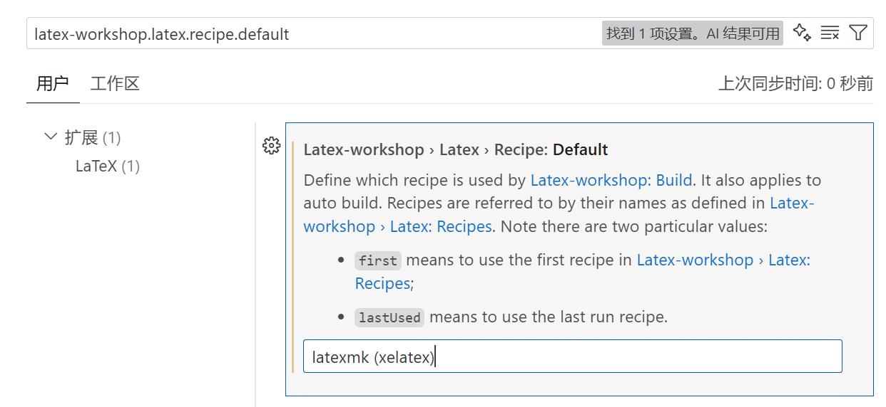
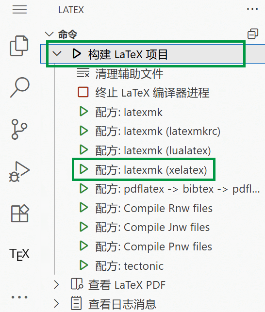
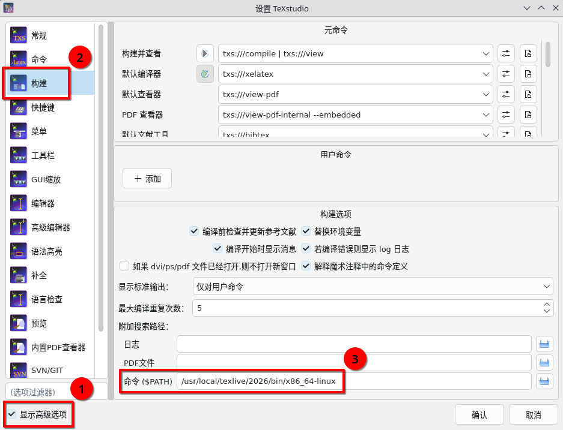

# 📃 编辑器配置与模板编译

与 Word 不同的是，LaTeX 模板需要我们用合适的工具进行编译，才能生成最终 PDF 文件。我们接下来先介绍 BIThesis 中的模板编译方法，再介绍如何在编辑器中进行配置。

如果你需要调试整个文档，或者采用 vim 等纯文本编辑器，你需要使用徒手编译的方式。

如果你追求开箱即用，你应该选择 TeXstudio 作为编辑器。

如果你使用 VS Code 作为编辑器，你需要安装 `LaTeX Workshop` 与 `LaTex Utilities` 两个插件用以辅助你编译生成最终 PDF 文件。

## 编译方式

BIThesis 中的模板编译方式大同小异，我们都会使用 `xelatex`、`biber` 以及 `latexmk` 等工具来编译它们。编译 BIThesis 有两种方法：

- 直接使用 `latexmk` 进行编译：只需要使用一次 `latexmk` 即可编译整个模板，自动识别中文环境与参考文献编译器，增量编译（推荐使用，编译比较方便快速 🚀）
- 使用 `xelatex` 配合 `biber` 进行编译：需要使用「四步走」`xelatex -> biber -> xelatex -> xelatex` 的编译顺序编译模板，全量编译（编译一次可能花费较长时间 🐌）

这两种编译方式均可以用于编译我们的模板，大家可以综合自己的使用习惯来挑选工具。事实上，后面我们将要介绍的 LaTeX 编辑器，它们背后所使用的编译方法就是运行这里提到的两种编译工具。只是我们需要单独配置编辑器的编译方法，才能让编辑器正确的调用编译方式，编译我们的 LaTeX 文档。

在这里，我挑选了三种常见的 LaTeX 编写环境：

- [徒手编译：直接在命令行中使用 `xelatex`、`biber` 或 `latexmk` 等工具编译 LaTeX 文档](#徒手编译)；
- [VS Code 配合 LaTeX 相关插件：使用 VS Code 编辑器配合 `LaTeX Workshop` 等插件](#配置-vs-code)；
- [TeXstudio：使用 TeXstudio 编辑器直接编写](#安装并配置-texstudio)。

我会依次介绍在这三种环境下 LaTeX 编译器配置方法。

## 徒手编译

> 这里提到的徒手编译仅需读者了解即可，用以帮助理解 LaTeX 的编译过程，同时推荐该方式作为其余方式遇到问题时的调试手段。

当然，你完全可以不借助任何编辑器，直接使用「命令行」编译 LaTeX 文档。

### 使用 `latexmk` 编译

如果你使用 `latexmk` 编译模板，那么你只需要使用如下的命令即可编译主文件为 `main.tex` 的 LaTeX 项目：

```bash
# 只需要调用一次 latexmk 工具即可
latexmk
```

编译 LaTeX 文档原本需要多步，但 latexmk 会自动按当前情况调用相关工具，既保证文档编译完全，又尽量跳过已完成步骤。因此，仅调用一次 latexmk 即可。

### 使用 `xelatex` 编译

如果你使用 `xelatex` 编译项目，那么你需要按照下面四步串联顺序调用 `xelatex` 与 `biber` 命令行工具：


比如，编译主文档为 `main.tex` 的 LaTeX 项目，我们具体的命令为：

```bash
# 第一步 xelatex
xelatex -no-pdf --interaction=nonstopmode main
# 第二步 biber
biber main
# 第三步 xelatex
xelatex -no-pdf --interaction=nonstopmode main
# 第四步 xelatex
xelatex --interaction=nonstopmode main
```

## 配置 VS Code

该方法适用于所有平台，尤其推荐使用 WSL 方案的同学采用。

请首先到 VS Code 官网下载安装 VS Code 编辑器，安装完成后打开 VS Code，进入插件市场（快捷键：<kbd>Ctrl</kbd>+<kbd>Shift</kbd>+<kbd>X</kbd>），搜索并安装 LaTeX Workshop 与 LaTeX Utilities 两个插件。这两个插件的具体功能在下面列出：

- LaTeX Workshop 插件：[Visual Studio Code LaTeX Workshop Extension](https://marketplace.visualstudio.com/items?itemName=James-Yu.latex-workshop)
  - 提供基本的浏览、编辑、自动补全、自动格式化 LaTeX 文档的功能
  - 提供在 VS Code 内直接预览 LaTeX 文档编译得到的 PDF 的功能
  - 提供编译工具链、自定义编译方法等功能
  - 提供 SyncTeX 双向定位功能（LaTeX 源码 <-> PDF）
- （可选）LaTeX Utilities 插件：[Visual Studio Code LaTeX Utilities](https://marketplace.visualstudio.com/items?itemName=tecosaur.latex-utilities)
  - 提供实时 LaTeX 文档字数统计的功能
  - 提供与参考文献管理工具 Zotero 连接的功能

:::warning 务必修改设置
LaTeX Workshop 默认设置无法编译大部分中文 LaTeX 文档，包括 BIThesis。

请务必按以下修改设置。
:::

<!-- prettier-ignore-start -->
<!-- 以下 vscode:// 链接的 target="_self" 会被 prettier 错误转义，不可自动格式化 -->

1. 将设置[`latex-workshop.latex.recipe.default`](vscode://settings/latex-workshop.latex.recipe.default){ target="_self" }从默认的`first`改为`latexmk (xelatex)`。

   

2. 取消勾选[`latex-workshop.latex.build.enableMagicComments`](vscode://settings/latex-workshop.latex.build.enableMagicComments){ target="_self" }，以允许用 latexmk 增量编译。

<!-- prettier-ignore-end -->

以后编译文档时，请打开`main.tex`所在文件夹（工作区），按默认方式“构建 LaTeX 项目”（快捷键：<kbd>Ctrl</kbd>+<kbd>Alt</kbd>+<kbd>B</kbd>），或者选择“配方: latexmk (xelatex)”；选择其它配方通常无法编译。

<figure>
  
</figure>

:::: details 报错 Failed to resolve: latexmk (xelatex) 或 Skipping undefined tool xelatexmk？ { style="border-color: var(--vp-custom-block-tip-border); color: var(--vp-custom-block-tip-text); background-color: var(--vp-custom-block-tip-bg);" }

> - [Builder] Failed to resolve build recipe: latexmk (xelatex).
> - Skipping undefined tool "xelatexmk" in recipe "latexmk (xelatex)."

如果打开`main.tex`编译时 LaTeX Workshop 报告以上错误之一，说明你之前修改过设置，覆盖了插件内置的`latexmk (xelatex)`配方或`xelatexmk`工具。

受影响的设置有两项：

- “编译**配方**” `"latex-workshop.latex.recipes": […]`——定义编译整个文档的工具链。编译 LaTeX 文档[可能需要多步](#使用-xelatex-编译)，工具链是指调用工具的范围和顺序。
- “编译**工具**” `"latex-workshop.latex.tools": […]`——定义调用每种工具时执行的具体命令，例如传给 `latexmk` 或 `xelatex` 的参数。

::: details 这些设置在哪里？
在 VS Code 中打开 UI 设置界面（快捷键：`ctrl/cmd + ,` ），单击右上角  按钮打开 JSON 格式设置`settings.json`，搜索（快捷键：`ctrl/cmd + F`）`latex-workshop.latex`。
:::

你可以把之前的设置注释掉（快捷键：<kbd>Ctrl</kbd>+<kbd>/</kbd>），或者如下自行复刻 LaTeX Workshop 的默认配方。

::: details 复刻默认配方
参考 LaTeX Workshop 代码仓库`package.json`中[配方](https://github.com/James-Yu/LaTeX-Workshop/blob/62dc3c812554e6fddd88c27eaf06df7d68716d9e/package.json#L998-L1003)、[工具](https://github.com/James-Yu/LaTeX-Workshop/blob/62dc3c812554e6fddd88c27eaf06df7d68716d9e/package.json#L1104-L1116)的默认值，在自己的`settings.json`中补充以下内容。

```json
"latex-workshop.latex.recipes": [
  {
    "name": "latexmk (xelatex)",
    "tools": [
      "xelatexmk"
    ]
  },
],
"latex-workshop.latex.tools": [
  {
    "name": "xelatexmk",
    "command": "latexmk",
    "args": [
      "-synctex=1",
      "-interaction=nonstopmode",
      "-file-line-error",
      "-xelatex",
      "-outdir=%OUTDIR%",
      "%DOC%"
    ],
    "env": {}
  },
],
```

:::

::::

::: details 单击按钮没有反应？

正常来讲，单击编译按钮后，底部状态栏左侧会用🔁提示进度，或者至少弹出报错信息。

<!-- prettier-ignore-start -->
<!-- 以下 vscode:// 链接的 target="_self" 会被 prettier 错误转义，不可自动格式化 -->
若完全没有反应，可能是因为屏蔽了报错。请启用[`latex-workshop.message.error.show`](vscode://settings/latex-workshop.message.error.show){ target="_self" }设置重试。
<!-- prettier-ignore-end -->

:::

:::: details 还有特殊需要？

<!-- prettier-ignore-start -->
<!-- 以下 vscode:// 链接的 target="_self" 会被 prettier 错误转义，不可自动格式化 -->

- **不想频繁擦写硬盘？**

  将[`latex-workshop.latex.autoBuild.run`](vscode://settings/latex-workshop.latex.autoBuild.run){ target="_self" }从默认的`onFileChange`改为`never`，然后按<kbd>Ctrl</kbd>+<kbd>Alt</kbd>+<kbd>B</kbd>编译。

- **想用 [SumatraPDF](https://www.sumatrapdfreader.org) 替代 VS Code 查看 PDF？**

  参考 [forward inverse search - VS Code & SumatraPDF InverseSearch Problem - TeX - LaTeX Stack Exchange](https://tex.stackexchange.com/a/697462)。

- **同时要编译其它不支持 xelatex 的 LaTeX 文档？**

  修改`latex-workshop.latex.*`设置时，从“用户”改为“工作区”。

  如果这些 LaTeX 文档不幸都在同一工作区，还可按文件设置。

  ::: details 按文件设置（不太推荐）

  有以下三种办法。
  - 启用[`latex-workshop.latex.build.enableMagicComments`](vscode://settings/latex-workshop.latex.build.enableMagicComments){ target="_self" }，让 LaTeX Workshop 识别`main.tex`中的`!TeX`/`!BIB`魔术注释。
  - 同上操作，然后将`main.tex`开头的魔术注释改为`% !LW recipe = latexmk (xelatex)`。若报错 Failed to resolve，按上文说明操作。
  - 保持`enableMagicComments`关闭，设置[`latex-workshop.latex.recipe.default`](vscode://settings/latex-workshop.latex.recipe.default){ target="_self" }为`lastUsed`，然后选择 LaTeX Workshop 内置的配方`latexmk (latexmkrc)`，让插件遵循`main.tex`旁边的`latexmkrc`。若报错 Failed to resolve，按上文说明参考`package.json`类推。

  :::
- **VS Code 编辑器中的一段太长了，我要折行（自动换行）？**
  
  启用[`editor.wordWrap`](vscode://settings/editor.wordWrap){ target="_self" }设置，或是使用快捷键 <kbd>Alt</kbd>+<kbd>Z</kbd> 打开/关闭折行（自动换行）。

  ::: details 只想在 LaTeX 文件中折行（自动换行）？

  在`settings.json`中添加以下内容：

  ```json
  "[latex]": {
    "editor.wordWrap": "on"
  },
  ```

  :::

<!-- prettier-ignore-end -->

其它需求请参考 [Compile · James-Yu/LaTeX-Workshop Wiki](https://github.com/James-Yu/LaTeX-Workshop/wiki/Compile)。

::::

## 安装并配置 TeXstudio

该方法无法适用于 WSL 方案的同学，因为 TeXstudio 无法在 WSL 中运行。

TeXstudio 的编译工具大部分已经为我们配置完毕，我们只需要在 TeXstudio 的设置中定义编译所用的编译器即可。

对于 Windows 和 macOS，我们可以访问 [TeXstudio 官网](https://www.texstudio.org/)或[校园网联合镜像站相应页面](https://mirrors.cernet.edu.cn/github-release/texstudio-org/texstudio/LatestRelease/)，下载安装对应系统的 TeXstudio。在 TeXstudio 中点击「选项 » 设置 TeXstudio」，在打开的窗口中选择「构建」，并在元命令里面将「默认编译器」设置为 `xelatex`，将默认文献工具设置为 `biber` 即可。

对于 Linux 用户，按照 [TeXstudio 官网](https://www.texstudio.org/)指示，可以直接使用系统的包管理器安装 TeXstudio，例如在 Ubuntu/Debian 上可以使用如下命令：

```bash
sudo apt install texstudio
```

:::warning 注意
尽管我们提供了 `latexmk` 编译支持，但是在 TeXstudio 中如果将「默认编译器」设置为 `latexmk`，会出现无法编译的问题。因此建议使用 `xelatex` 选项。
:::


你可以使用快捷键 <kbd>F5</kbd> 一键编译与预览 LaTeX 项目。

::::details 使用 Linux TeXstudio 的注意事项
由于 Linux 版本的 TeXstudio 默认使用系统包管理器管理的 TeX Live 安装（一般指向 `/usr/bin`），而我们是使用的是单独安装的 TeX Live，因此需要在 TeXstudio 的设置中将命令的路径修改为已安装 TeX Live 中的 `xelatex` 和 `biber` 的路径，否则会出现无法编译的问题。

打开选项-设置 TeXstudio-命令选项卡，按右侧的「选择程序」按钮，根据你实际安装的 TeX Live 版本和路径进行修改。例如，如果你安装的 TeX Live 版本是 2026，并且安装在 `/usr/local/texlive/2026`，那么你需要将相关命令的路径修改为如下图所示：



修改完成后，点击「确定」保存设置即可，这样 TeXstudio 就可以使用我们安装的 TeX Live 进行编译了。
::::

## 编译示例模板

如果你已经按照上述方法配置好了编译器，那么你就可以尝试编译 BIThesis 模板中的示例文档了。

如果你使用的是徒手编译，那么你可以在命令行中进入模板文件夹，使用上述方法编译 `main.tex` 文件，若能够得到示例 PDF 文件，则说明配置成功。

如果你使用的是 VS Code，请使用 VS Code 打开模板文件夹，按下 <kbd>Ctrl</kbd>+<kbd>Alt</kbd>+<kbd>B</kbd>，若能够得到示例 PDF 文件，则说明配置成功。

如果你使用的是 TeXstudio，请使用 TeXstudio 打开模板文件夹中的 `main.tex` 文件，软件会自动识别整个项目并使用我们配置的编译器进行编译，按下 <kbd>F5</kbd>，若能够得到示例 PDF 文件，则说明配置成功。

如果你未能成功编译示例文档，请检查上述步骤是否正确完成，或参考[常见问题](../faq/index.md)寻找解决方案，若仍有问题，可[加入交流群](https://jq.qq.com/?_wv=1027&k=KYDrmS5z)提供你的报错信息以寻求帮助。

需要注意的是，如果你是使用 WSL 方案安装的 TeX Live，那么你需要确保模板文件夹被正确放置在 WSL 的 Linux 子文件系统中，不要在 Windows 文件系统中直接操作，否则可能会导致编译性能大幅下降甚至编译失败。

## 后续指南

至此，您已完成[食用方法](./intro.md#食用方法)的三个步骤，应当可以开始写作了！注意写作需按 LaTeX 语法编辑`*.tex`文件。如您之前未接触过，可参考[先前《快速使用指南》](./intro.md)的第3章与第4章或本站 [👩‍🏫 LaTeX 学习与使用资源](./resources.md)。

如果遇到问题，可 [✋ 参考先前指引搜索本站、查询互联网或加群询问同学](./intro.md#help)；不过常见问题应已在模板中做出说明，请查看模板文件夹中的`README.md`和`*.tex`中的示例代码、注释。

如果你觉得缺失任何内容，或有其它意见建议，欢迎[到代码仓库提出](https://github.com/BITNP/BIThesis/issues)。
