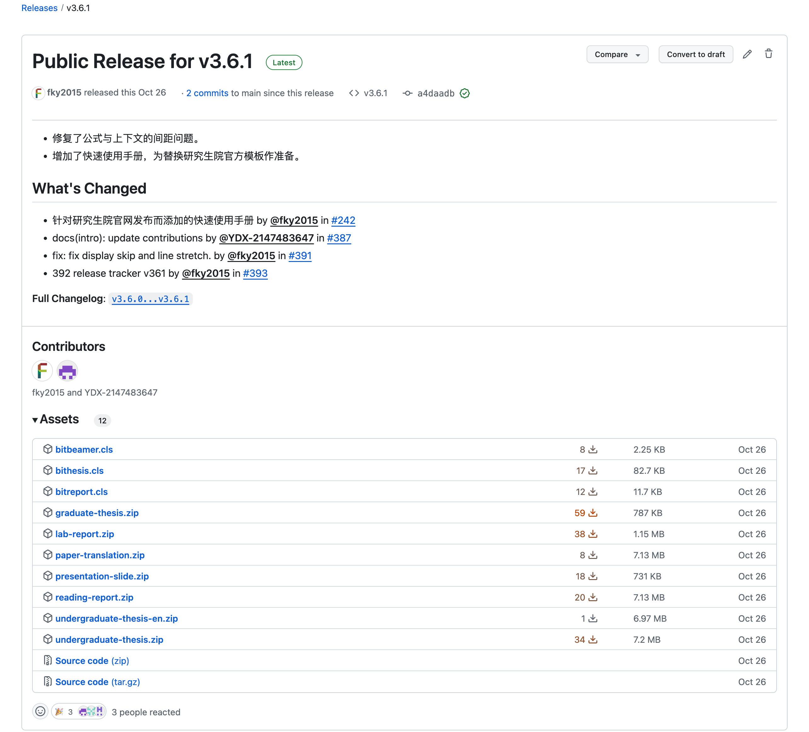

# 📁 下载与使用模板

:::warning 📖 初次使用？
若是初次使用，请先阅读本 Wiki 全部内容或快速使用指南，再开始写作。

- 阅读本 **Wiki**：[从这里开始](./intro.md#食用方法)。
- **快速使用指南**：[本科][undergraduate-handbook]／[硕博][graduate-handbook]。

:::

## 下载模板包并解压

👉 最新版本：[🏫 校内开源镜像站][mirror]／[👽 校外 GitHub release][latest-release]。

下载你需要的模板包，解压到本地即可使用。

- 硕博·学位论文 — `graduate-thesis.zip`
- 本科·毕业设计
  - 论文 — `undergraduate-thesis.zip`
  - 论文（全英文专业） — `undergraduate-thesis-en.zip`
  - 外文翻译 — `paper-translation.zip`
- 本科·读书报告 — `reading-report.zip`
- 演示文档 — `presentation-slide.zip`
- 实验报告 — `lab-report.zip`

:::tip ⛔ 无须克隆仓库
若从 GitHub 下载，只从 [Releases][releases] 下载压缩包即可，不需要也不建议`git clone …`。

为了方便各位同学使用，项目已按照发布 Release 流程，将每个模板单独打包，解压即可使用。而仓库围绕开发，缺少自动生成的文件，并且包含多个模板，并不方便使用。

另外，即使您日后要更新模板，也是下载新的`*.cls`替换原有的，并非`git pull`。
:::

## 日后更新升级

BIThesis 会不时更新，主要是满足学校、同学新的细节要求，此外适配宏包、改善文档。如果使用遇到问题，可考虑升级模板：

1. 从上文地址下载新的文档类（论文`bithesis.cls`／幻灯片`bitbeamer.cls`／实验报告`bitreport.cls`）
2. 替换原有`*.cls`文件
3. 重新编译

更新说明请移步 [GitHub Releases][latest-release] 或[本站备份](../news/index.md)。

[mirror]: https://mirror.bit.edu.cn/github-release/BITNP/BIThesis/LatestRelease/ '北京理工大学开源镜像站 - BIThesis镜像'
[releases]: https://github.com/BITNP/BIThesis/releases/ 'Releases · BITNP/BIThesis'
[latest-release]: https://github.com/BITNP/BIThesis/releases/latest 'Latest Release · BITNP/BIThesis'
[undergraduate-handbook]: https://mirrors.ctan.org/macros/unicodetex/latex/bithesis/bithesis-handbook-undergraduate.pdf
[graduate-handbook]: https://mirrors.ctan.org/macros/unicodetex/latex/bithesis/bithesis-handbook-graduate.pdf
