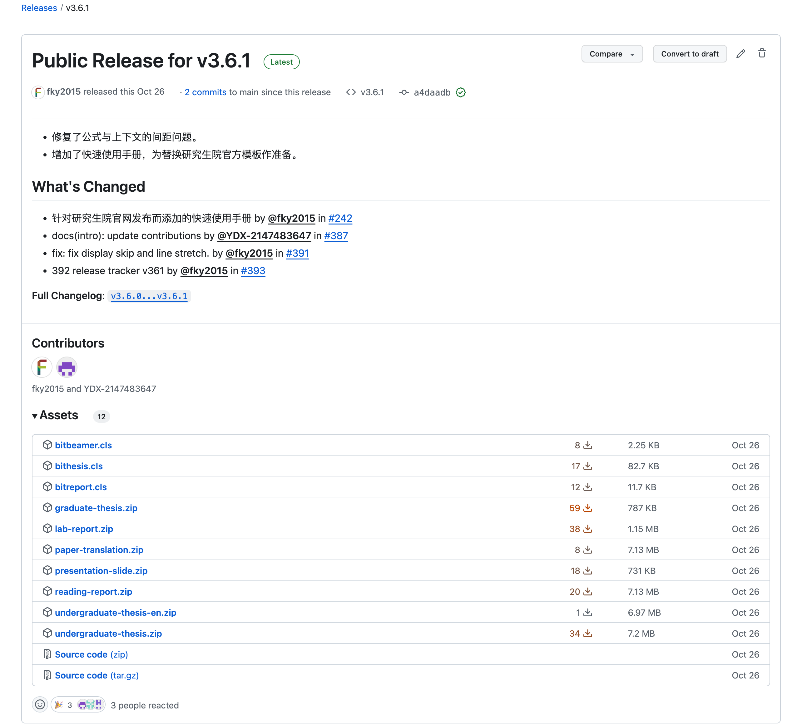

# 📁 下载与使用模板

:::warning 📖 初次使用？
若是初次使用，请先阅读本 Wiki 全部内容或快速使用指南，再开始写作。

- 阅读本 **Wiki**：[从这里开始](./intro.md)。
- **快速使用指南**：[本科][undergraduate-handbook]／[硕博][graduate-handbook]。

:::

## 选择你的写作平台

常见的写作平台有两大类：**本地平台**和**在线平台**。BIThesis 支持在所有平台上使用，且编译得到的 PDF 几乎没有差别。你可以根据自己的需求选择适合的写作平台：

- 本地平台：需配置本地编译环境和编辑器，上手较慢，但完全可控
  - Windows：性能较低，上手简单，不存在任何兼容性问题，该版本编译出的 PDF 可视为标准版本，是最稳妥的选择；
  - WSL(Windows Subsystem for Linux)：性能接近 Linux/macOS，高于 Windows 原生，对不熟悉 Linux 的人有一定门槛，属于比较平衡的选择；
  - Linux/macOS：性能最高的平台，但存在[字体问题](../faq/word-font.md#linuxmacos-等其它本地平台难度unix)需要解决，适合有一定 LaTeX 使用经验、追求高性能、自动化的用户。
- 在线平台：开箱即用，无需配置本地环境，网页端写作
  - TexPage：国内在线平台，中文支持完善，网络稳定，与本地平台的区别是有编译时长限制，免费版使用的时长完全足够；
  - Overleaf：国外在线平台，对中文支持有限，需自行解决中文[字体问题](../faq/word-font.md#overleaf-等在线平台难度overleaf)，且免费版存在较强限制，实测很难完成模板的编译，目前不推荐使用该平台。

如果你选择在在线平台写作，点击[模板表格](./preface.md#qbithesis-都包含哪些模板)中的 `open in TeXPage`、`open in Overleaf` 按钮，在对应的在线平台中直接打开相应模板（需注册账号），开始写作。

如果你选择在本地平台写作，你需要先在本页面的给出链接中下载好你需要的模板包，在本地解压做好准备工作，再参考后续教程来完成安装配置等工作，开始写作。

## 下载模板包并解压

👉 最新版本：[🏫 校内开源镜像站][mirror]／[👽 校外 GitHub release][latest-release]。

下载你需要的模板包，解压到本地即可使用。

- 硕博·学位论文 — `graduate-thesis.zip`
- 本科·毕业设计
  - 论文 — `undergraduate-thesis.zip`
  - 论文（全英文专业） — `undergraduate-thesis-en.zip`
  - 外文翻译 — `paper-translation.zip`
- 本科·读书报告 — `reading-report.zip`
- 演示文档 — `presentation-slide.zip`
- 实验报告 — `lab-report.zip`

:::tip ❓ `STXIHEI.TTF` 是什么文件？为什么会附带在压缩包里？
`STXIHEI.TTF` 是华文细黑字体文件，学校的本科毕业论文要求中用到了这一字体，部分系统可能没有预装这种字体，会导致 BIThesis 编译报错。

因此我们将这个字体附带在压缩包中，编译的时候会自动搜索并使用该字体，以确保所有用户都能顺利编译模板。
:::

:::tip ⛔ 无须克隆仓库
若从 GitHub 下载，只从 [Releases][releases] 下载压缩包即可，不需要也不建议`git clone …`。

为了方便各位同学使用，项目已按照发布 Release 流程，将每个模板单独打包，解压即可使用。而仓库围绕开发，缺少自动生成的文件，并且包含多个模板，并不方便使用。

另外，即使您日后要更新模板，也是下载新的`*.cls`替换原有的，并非`git pull`。
:::

## 日后更新升级

BIThesis 会不时更新，主要是满足学校、同学新的细节要求，此外适配宏包、改善文档。如果使用遇到问题，可考虑升级模板：

1. 从上文地址下载新的文档类（论文`bithesis.cls`／幻灯片`bitbeamer.cls`／实验报告`bitreport.cls`）
2. 替换原有`*.cls`文件
3. 重新编译

更新说明请移步 [GitHub Releases][latest-release] 或[本站备份](../news/index.md)。

[mirror]: https://mirror.bit.edu.cn/github-release/BITNP/BIThesis/LatestRelease/ '北京理工大学开源镜像站 - BIThesis镜像'
[releases]: https://github.com/BITNP/BIThesis/releases/ 'Releases · BITNP/BIThesis'
[latest-release]: https://github.com/BITNP/BIThesis/releases/latest 'Latest Release · BITNP/BIThesis'
[undergraduate-handbook]: https://mirrors.ctan.org/macros/unicodetex/latex/bithesis/bithesis-handbook-undergraduate.pdf
[graduate-handbook]: https://mirrors.ctan.org/macros/unicodetex/latex/bithesis/bithesis-handbook-graduate.pdf
