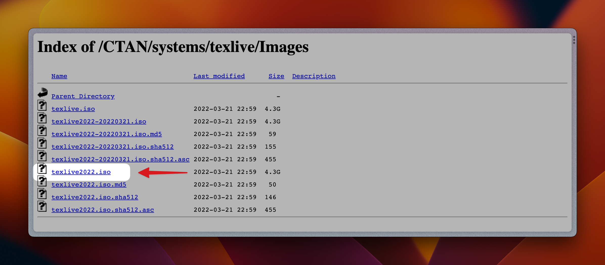
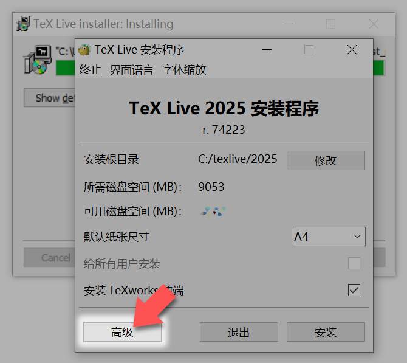
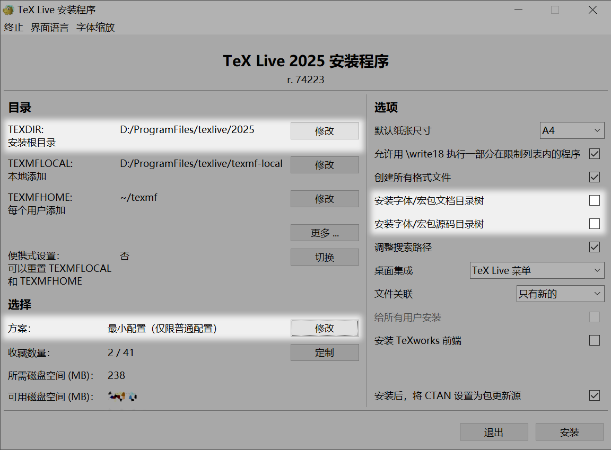
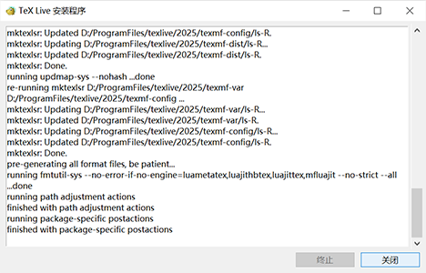
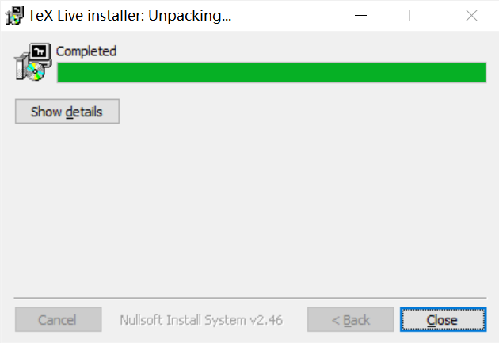
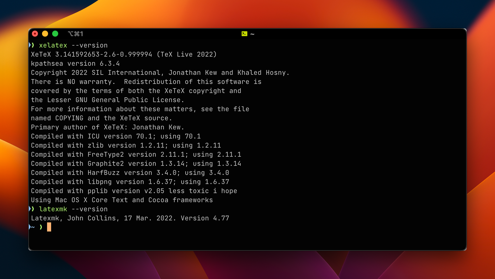
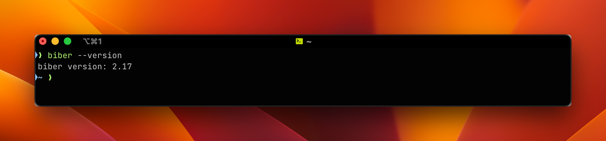
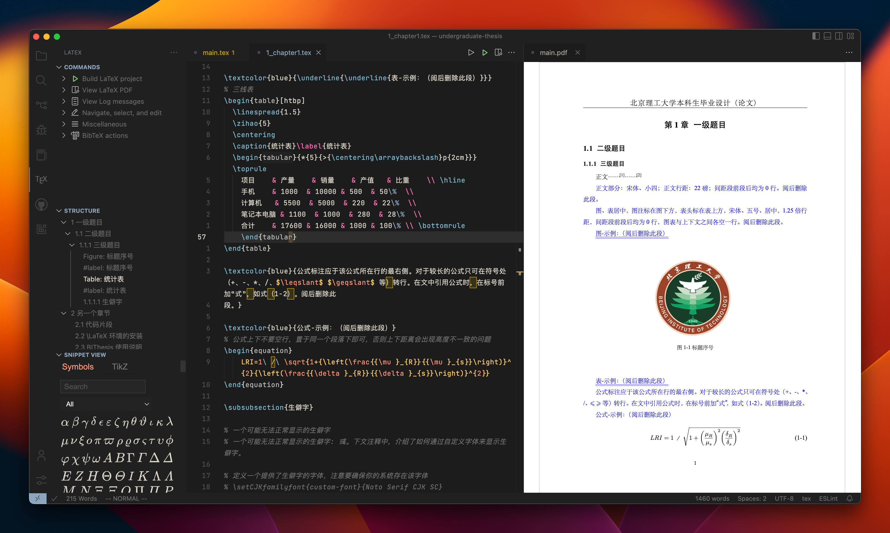

# 🍌 如何开始

## 准备工作

首先，在使用模板之前，你需要在本机安装 LaTeX 环境。一个完整的 LaTeX 环境包括：

- 开源免费的 LaTeX 发行版（LaTeX 编译器 + 宏包）
- 以及一个得心应手的 LaTeX 编辑器

我们在 Windows、macOS 与 Linux 环境中均可以使用 LaTeX 进行文档撰写。按照操作系统的不同，我们分别进行介绍。

## 下载合适的 LaTeX 发行版

:::details 🔼 要求 TeX Live 至少 2021，推荐使用最新版 TeX Live （单击展开详情）

为满足我校要求，BIThesis 实现[[texdoc:biblatex-gb7714-2015|参考文献著录]]、[[texdoc:ctex|章节层次]]等细节时，使用了新版特性，不支持早于 2021 的 TeX Live。

若之前安装过旧版 TeX Live，请按下文安装最新版[^multiple-texlive]，或考虑使用在线平台。

[^multiple-texlive]: 只要自行切换`$PATH`，TeX Live 支持多版本共存，MiKTeX 等其它发行版通常也支持与 TeX Live 共存。

:::

官方安装指南位于 [Installing TeX Live over the Internet](https://www.tug.org/texlive/acquire-netinstall.html)。

<!-- 此处应与《快速使用指南》同步更新 -->

- **Windows**

  参考 [Easy install](https://www.tug.org/texlive/windows.html#install)，下载并运行 [`install-tl-windows.exe`](https://mirror.ctan.org/systems/texlive/tlnet/install-tl-windows.exe)，它会在线下载所需文件并安装。

- **Linux**

  参考 [Quick install](https://www.tug.org/texlive/quickinstall.html)，下载 [`install-tl-unx.tar.gz`](https://mirror.ctan.org/systems/texlive/tlnet/install-tl-unx.tar.gz) 并解压，运行 `install-tl`，它会在线下载所需文件并安装。

  ::: warning 💀 谨慎使用系统包管理器安装
  非滚动发行的发行版（如Ubuntu和Debian等）的系统包管理器（如apt）提供的 TeX Live [一般较旧](https://repology.org/project/texlive/versions)（Homebrew 除外），且无法选择安装策略，通常很难使用。如果仍希望使用系统包管理器安装 TeX Live ，请注意，由系统包管理器管理的软件包不应被其他包管理器同时管理，这意味着采用系统包管理器安装的 TeX Live 不应使用 `tlmgr` 更新或安装 TeX 宏包，这意味着您将不能按照想法随意的安装和更新 TeX 宏包。
  :::

- **macOS**

  TeX Live 在 macOS 上包装成了 [MacTeX](https://www.tug.org/mactex/)。MacTeX 以 `pkg` 文件发布。我们进入 [MacTeX 的下载页面](https://www.tug.org/mactex/mactex-download.html)，下载完整安装包 `MacTeX.pkg`（大约 6 GB），然后双击运行安装。

  ::: details 🍺 也可使用 Homebrew

  使用 Homebrew 包管理的同学，也可以通过 Homebrew Cask 直接安装 MacTeX：

  ```bash
  # 加载 Homebrew Cask
  brew tap caskroom/cask

  # 利用 Cask 安装 MacTeX
  brew cask install mactex
  ```

  :::

:::: details 📦 也可离线安装

使用北京理工大学校园网的同学也可以直接使用我校官方 TeX Live 镜像进行安装。我校 TeX Live 镜像资源位于 [/CTAN/systems/texlive/Images](https://mirrors.bit.edu.cn/CTAN/systems/texlive/Images/)，其中我们选择下载 `texlive20xx.iso` 即可。Windows 10 / Windows 11 及以上版本可直接挂载 ISO 镜像（双击即可），其余系统用合适的软件也可。之后在打开的文件夹中点击执行 `install-tl-windows`（Windows）或 `install-tl`（Linux）即可离线安装全部 TeX Live 组件。

::: warning ❗ 请注意
北理工镜像站仅支持校内访问，因此从非校园网环境访问上面镜像资源将无法打开，对此我们可以选用其他的镜像源。

另注：安装过程中注意使用合适的权限。
:::



::::

### 精简安装内容

Windows 和 Linux 的在线安装程序`install-tl*`默认下载安装“完整”发行版，一般 3 GB 左右，需要一两小时。若不介意，一路默认，放着等待，最后[确认安装](#确认安装)即可。

如果你介意，可按以下精简安装内容（Windows 六七百 MB，Linux 四五百 MB），保证 BIThesis 基本使用，日后有需要再补充。

::: details 精简安装内容——🎨 图形界面（以 Windows 为例）

1. **下载并启动安装程序**

   下载并运行[`install-tl-windows.exe`](https://mirror.ctan.org/systems/texlive/tlnet/install-tl-windows.exe)，待弹出下图“TeX Live 安装程序”，单击「高级」。

    { style="max-width: 20em; margin: auto;" }

2. **安装基础设施**

   - 修改「目录 → TEXDIR 安装根目录」为任意无需管理员权限的目录
   - 修改「选择 → 方案」为「最小配置（仅限普通配置）」
   - 取消勾选「选项 → 安装字体/宏包文档、源码目录树」

   

   如上图完成修改后，单击「安装」。

   一般等待四五分钟，就会提示 finished，可以「关闭」并「Close」了。

   <div style="display: grid; grid-template-columns: 1.2fr 1fr; gap: 1em; align-items: center;">
     
     
   </div>

3. **安装宏包**

   下载 [BIThesis 所需宏包列表](https://github.com/BITNP/BIThesis/raw/refs/heads/main/.github/tl_packages)，然后打开 PowerShell，用 tlmgr（TeX Live package manager）安装。

   ```powershell
   curl -LO https://github.com/BITNP/BIThesis/raw/refs/heads/main/.github/tl_packages
   tlmgr install ((Get-Content ./tl_packages) -replace '\s*#.*', '')
   ```

   正常等待十分钟左右即完成安装。

:::

::: details 精简安装内容——🔧 命令行界面（以 Linux 为例）

1. **下载并解压安装程序**

   ```shell
   curl -LO https://mirror.ctan.org/systems/texlive/tlnet/install-tl-unx.tar.gz
   tar -zxvf install-tl-unx.tar.gz
   cd install-tl-*  # 目录具体名称包含日期
   ```

2. **安装基础设施**

   这里将安装目录从默认`/usr/local/texlive/`改为了`~/.texlive/`，因为前者可能需要 sudo。

   ```shell
   mkdir ~/.texlive/
   ./install-tl --texdir=~/.texlive --scheme=scheme-minimal --no-doc-install --no-src-install
   ```

   <!--
       运行 install-tl 需要 perl，但一般已预装，就不专门说了。
       https://www.perl.org/get.html
   -->

   运行`install-tl`时会先暂停，打印安装信息。我们确认无误后，如下输入`I`启动安装。

   ```log
   Actions:
    <I> start installation to hard disk
    <P> save installation profile to 'texlive.profile' and exit
    <Q> quit

   Enter command: ✍  输入“I”
   ```

   一般等待一两分钟，程序就会结束运行，并如下提示成功安装。（此时就可以删除`install-tl-*`目录及安装程序了。）

   ```log
   Welcome to TeX Live!
   …
   Add ~/.texlive/texmf-dist/doc/man to MANPATH.
   Add ~/.texlive/texmf-dist/doc/info to INFOPATH.
   Most importantly, add ~/.texlive/bin/x86_64-linux
   to your PATH for current and future sessions.
   ```

   然后我们应按以上提示**添加环境变量**。示例配置如下，具体与操作系统和 shell 有关，可上网搜索或问人工智能。

   ```bash
   export PATH="$HOME/.texlive/bin/x86_64-linux:$PATH"
   export MANPATH="$HOME/.texlive/texmf-dist/doc/man:$MANPATH"
   export INFOPATH="$HOME/.texlive/texmf-dist/doc/info:$INFOPATH"
   ```

3. **安装宏包**

   下载 [BIThesis 所需宏包列表](https://github.com/BITNP/BIThesis/raw/refs/heads/main/.github/tl_packages)，然后用 tlmgr（TeX Live package manager）安装。

   ```shell
   curl -LO https://github.com/BITNP/BIThesis/raw/refs/heads/main/.github/tl_packages
   tlmgr install $(sed -E 's/#.*//' ./tl_packages)
   ```

   正常等待四五分钟即完成安装。

4. **安装 Times New Roman 字体**（可与上一步同时进行）

   微软字体免费但有限制，Linux 发行版可能没有预装，需要补装。

   ```shell
   sudo apt install ttf-mscorefonts-installer
   # 然后按照提示同意用户协议
   ```

:::

:::: tip 日后补充安装

::: details 📦 补充宏包

若用别的宏包时遇到 File not found 错误，可按需[使用 tlmgr 补装](./commands.md#tlmgr)，例如：

```shell
$ latexmk
…
! LaTeX Error: File `upquote.sty' not found.
Type X to quit …
👆 发现缺失 upquote.sty，先输入“X”中止编译

👇 然后补装 https://ctan.org/pkg/upquote
$ tlmgr install upquote
…
```

:::

::: details 📖 补充本地宏包手册

以上“精简”了本地宏包手册，一般用 [texdoc 在线版](https://texdoc.org) 替代即可。

若希望在 TeX Live 安装目录保存宏包手册，可指定`--with-doc`，例如：

```shell
# 新装宏包并保存文档（若已装过，会放弃并提示 package already present）
tlmgr install --with-doc minted algorithm2e …

# 重装已有宏包，并补充文档
tlmgr install --reinstall --with-doc --no-depends ctex biblatex-gb7714-2015 …
```

::::

### 确认安装

为了保证我们 LaTeX 发行版的安装没有问题，我们需要验证一下 LaTeX 编译工具的安装情况。我们打开终端（Windows 打开 PowerShell、macOS 打开 Terminal、Linux 打开你所使用的终端模拟器），在其中输入下面的命令：

- 验证 `latexmk`、`xelatex` LaTeX 编译器的安装情况：

  ```bash
  # 验证 latexmk 的安装
  latexmk --version
  # 验证 xelatex 的安装
  xelatex --version
  ```

  

- 验证 `biber` 参考文献编译器的安装情况：

  ```bash
  biber --version
  ```

  

出现类似的输出，说明我们编译器安装应该是没有问题的。

## 挑选合适的 LaTeX 编辑器

理论上来说，任何一个「文本编辑器」均可以用来撰写 LaTeX 文档，但是一个得心应手的 LaTeX 编辑器一定会让我们撰写论文的效率大增。

### 使用 VS Code 配合 LaTeX Workshop 插件编辑 LaTeX 文档

VS Code 是微软开发的基于 Electron 跨平台技术的新晋代码编辑器，开源免费、拓展性强、功能强大，是当代开发者的首选。用 VS Code 配合 LaTeX Workshop 插件我们可以打造一个强大的 LaTeX 编辑器。



- 安装 VS Code 编辑器：[Visual Studio Code - Code editing. Redefined.](https://code.visualstudio.com/)
- 安装插件：
  - 安装 LaTeX Workshop 插件：[Visual Studio Code LaTeX Workshop Extension](https://marketplace.visualstudio.com/items?itemName=James-Yu.latex-workshop)
    - 提供基本的浏览、编辑、自动补全、自动格式化 LaTeX 文档的功能
    - 提供在 VS Code 内直接预览 LaTeX 文档编译得到的 PDF 的功能
    - 提供编译工具链、自定义编译方法等功能
    - 提供 SyncTeX 双向定位功能（LaTeX 源码 <-> PDF）
  - （可选）安装 LaTeX Utilities 插件：[Visual Studio Code LaTeX Utilities](https://marketplace.visualstudio.com/items?itemName=tecosaur.latex-utilities)
    - 提供实时 LaTeX 文档字数统计的功能
    - 提供与参考文献管理工具 Zotero 连接的功能

使用 VS Code 作为 LaTeX 编辑器时，我们需要特别配置编译工具 `tools` 与编译工具链 `recipes`。对于包含有目录、参考文献、图片与表格引用的 LaTeX 文档，我们往往需要使用多个编译工具串联编译。[具体的 VS Code 编译方法会在后文介绍](./configure-and-compile.md#使用-vs-code-撰写与编译-latex-模板)，请继续阅读。

### 使用 TeXstudio 编辑 LaTeX 文档

TeXstudio 是老牌 LaTeX 编辑器，使用跨平台技术 Qt 编写而成。虽然界面相对老旧，但是依旧可靠。我们可以去 [TeXstudio 的官网](https://www.texstudio.org/)下载安装各个系统版本的 TeXstudio。


默认情况下 TeXstudio 的编译工具链均已经配置完毕，基本开箱即用。对于如何用 TeXstudio 编译本模板，请继续阅读。

准备就绪后，我们就可以开始使用 BIThesis 提供的模板进行 LaTeX 文档的撰写啦！请继续阅读：[📃 下载与使用模板](./downloading-using-templates.md)。
