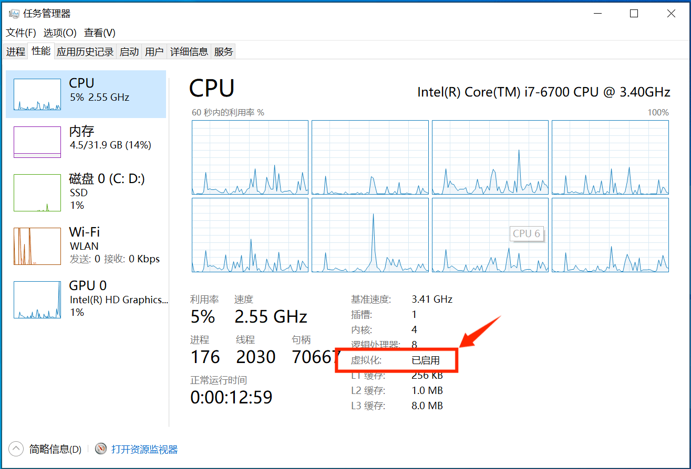
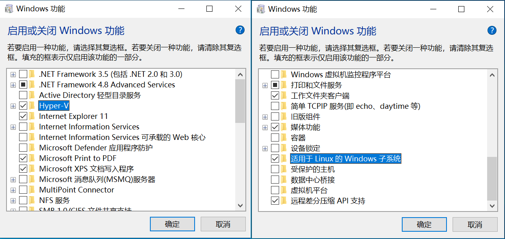
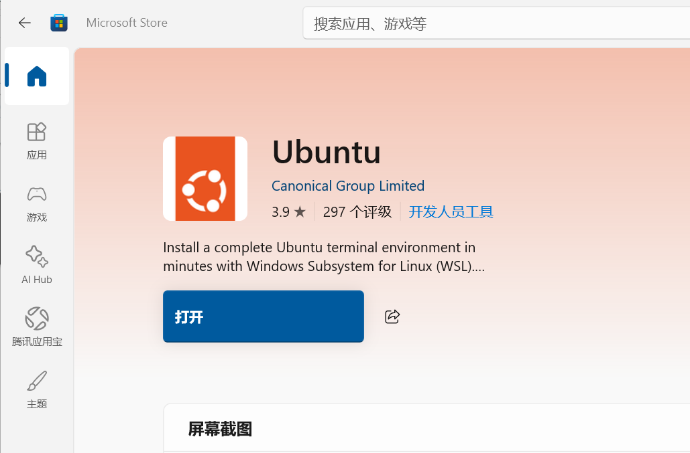

# 🍌 如何开始——安装 LaTeX 环境

::: tip ☁ 也可用在线平台
接下来的安装教程主要面向的是本地部署 LaTeX 环境并编写文档的同学，你也可不在本地准备环境，换用浏览器在线操作。请参考《**快速使用指南**》（[本科][undergraduate-handbook]／[硕博][graduate-handbook]）开头。
:::
[undergraduate-handbook]: https://mirrors.ctan.org/macros/unicodetex/latex/bithesis/bithesis-handbook-undergraduate.pdf#section1.2
[graduate-handbook]: https://mirrors.ctan.org/macros/unicodetex/latex/bithesis/bithesis-handbook-graduate.pdf#section1.2

首先，在使用模板之前，你需要在本机安装 LaTeX 环境。一个完整的 LaTeX 环境包括两部分：

- 开源免费的 LaTeX **发行版**（LaTeX 编译器 + 宏包）
- 以及一个得心应手的 LaTeX **编辑器**

我们在 Windows、macOS 与 Linux 环境中均可以使用 LaTeX 进行文档撰写，该部分主要介绍 LaTeX 的编译环境安装。按照安装方式和操作系统的不同，我们分别进行介绍。

## 安装工作

:::details 🔼 要求 TeX Live 至少 2021，请尽量使用最新版（单击展开详情）

为满足我校要求，BIThesis 实现[[texdoc:biblatex-gb7714-2015|参考文献著录]]、[[texdoc:ctex|章节层次]]等细节时，使用了新版特性，不支持早于 2021 的 TeX Live。

若之前安装过旧版 TeX Live，请按下文安装最新版[^multiple-texlive]，或考虑使用在线平台。

[^multiple-texlive]: 只要自行切换`$PATH`，TeX Live 支持多版本共存，MiKTeX 等其它发行版通常也支持与 TeX Live 共存。

:::

这里的安装教程提供在线安装、离线安装与精简安装三种方式。本教程以安装 TeX Live 2026 为例进行说明，在线安装针对 Windows、Linux 与 macOS 三种平台，离线安装针对 Windows、Linux 与 WSL 三种平台，精简安装针对 Windows、Linux 与 macOS 三种平台。

其中，在线安装、离线安装为全量安装，占用空间较大（约 **8～10GB** ），因此安装前请确保硬盘有足够空间。如果你的硬盘空间不足，请使用精简安装方式（约 **1GB** ）进行安装，或是使用在线平台进行写作。

请根据你选择的安装方式与平台，按下对应的按钮来获得对应的安装教程。

---

<InstallGuide />

<!-- 默认显示在线安装-Windows平台的指南，请根据需要选择其他选项 -->

<!-- ==================== 在线安装内容 ==================== -->

<InstallContent method="online" platform="windows" defaultShow>
<!-- 在线安装-Windows -->

::::warning ❕ 注意
在线安装需要从镜像站拉取 TeX Live 相关文件，因此请确保整个安装过程有稳定的网络环境，如果网络环境较差的话，建议采用离线安装方式。
::::

参考 [Easy install](https://www.tug.org/texlive/windows.html#install)，下载并运行 [`install-tl-windows.exe`](https://mirror.ctan.org/systems/texlive/tlnet/install-tl-windows.exe)，你只需要一路确认即可，它会自动在线下载所需文件并安装。

即完成了在 Windows 上的 TeX Live 在线安装。

</InstallContent>

<InstallContent method="online" platform="linux">
<!-- 在线安装-Linux -->

::::warning ❕ 注意
在线安装需要从镜像站拉取 TeX Live 相关文件，因此请确保整个安装过程有稳定的网络环境，如果网络环境较差的话，建议采用离线安装方式。
::::

参考 [Quick install](https://www.tug.org/texlive/quickinstall.html)，下载 [`install-tl-unx.tar.gz`](https://mirror.ctan.org/systems/texlive/tlnet/install-tl-unx.tar.gz) 并解压，运行 `install-tl`，它会在线下载所需文件并安装。

::: details 💀 谨慎使用系统包管理器安装 { style="border-color: var(--vp-custom-block-danger-border); color: var(--vp-custom-block-danger-text); background-color: var(--vp-custom-block-danger-bg);" }

非滚动发行的发行版（如 Ubuntu 和 Debian 等）的系统包管理器（如 apt）提供的 TeX Live [一般较旧](https://repology.org/project/texlive/versions)（Homebrew 除外），且无法选择安装方案，通常很难使用。

如果坚持使用系统包管理器安装 TeX Live，那以后切勿随意安装、更新或移除宏包。由系统包管理器管理的软件包不应被其他包管理器同时管理，所以采用系统包管理器安装的 TeX Live 不应再使用 tlmgr 管理 TeX 宏包。
:::

我们接下来需要按照安装程序的要求配置环境变量。使用 vi、nano 或其他文本编辑器打开 `~/.bashrc` 文件，在文件末尾添加以下内容：

```bash
export PATH=/usr/local/texlive/2026/bin/x86_64-linux:$PATH
export MANPATH=/usr/local/texlive/2026/texmf-dist/doc/man:$MANPATH
export INFOPATH=/usr/local/texlive/2026/texmf-dist/doc/info:$INFOPATH
```

保存并关闭文件后，输入以下命令使环境变量生效：

```bash
source ~/.bashrc
```

::::warning ❗ 字体问题

需要注意的是，部分 Linux 发行版（如 Debian）可能不会预装微软的 Times New Roman 字体，因此需要补装字体（注意此时需要开启 `contrib` 源），即执行如下命令：

```bash
sudo apt install ttf-mscorefonts-installer
```

按照提示确认用户协议后即可完成安装。

在 Linux 上，学校要求使用的中易字库由于版权等历史原因并未预装，因此，BIThesis 会默认使用与相关字体有极小差别的开源字体。当你特别在意这些问题时，请参照 [疑难杂症 - 中文字体如何才能与 Word 模板完全相同？（换用中易字库）](../faq/word-font.md) 进行修正。
::::

即完成了在 Linux 上的 TeX Live 在线安装。

</InstallContent>

<InstallContent method="online" platform="macos">
<!-- 在线安装-macOS -->

::::warning ❕ 注意
在线安装需要从镜像站拉取 TeX Live 相关文件，因此请确保整个安装过程有稳定的网络环境，如果网络环境较差的话，建议采用离线安装方式。
::::

TeX Live 在 macOS 上包装成了 [MacTeX](https://www.tug.org/mactex/)。MacTeX 以 `pkg` 文件发布。我们进入 [MacTeX 的下载页面](https://www.tug.org/mactex/mactex-download.html)，下载完整安装包 `MacTeX.pkg`（大约 6 GB），然后双击运行安装。

使用 Homebrew 包管理的同学，也可以[通过 Homebrew Cask 直接安装 MacTeX](https://formulae.brew.sh/cask/mactex)：

```bash
brew install --cask mactex
```

:::: warning ❗ 字体问题
在 macOS 上，学校要求使用的中易字库由于版权等历史原因并未预装，因此，BIThesis 会默认使用与相关字体有极小差别的开源字体。当你特别在意这些问题时，请参照 [疑难杂症 - 中文字体如何才能与 Word 模板完全相同？（换用中易字库）](../faq/word-font.md) 进行修正。
::::

即完成了在 macOS 上的 TeX Live 在线安装。

</InstallContent>

<!-- ==================== 离线安装内容 ==================== -->

<InstallContent method="offline" platform="windows">
<!-- 离线安装-Windows -->

使用北京理工大学校园网的同学可以直接使用我校官方 TeX Live 镜像进行安装。

我校 TeX Live 镜像资源位于 [/CTAN/systems/texlive/Images](https://mirrors.bit.edu.cn/CTAN/systems/texlive/Images/)，其中我们选择下载 `texlive20xx.iso` 即可。

::: warning ❗ 请注意
北理工镜像站仅支持校内访问，因此从非校园网环境访问上面镜像资源将无法打开，如无法连接校园网则可以选用其他的 [CTAN 镜像源](https://mirrors.ctan.org/systems/texlive/Images/)。

另注：安装过程中注意使用合适的权限。
:::

对于 Windows 10 / Windows 11 及以上版本，可以直接挂载 ISO 镜像（双击即可），其余系统用合适的软件也可。之后在打开的文件夹中点击执行 `install-tl-windows.bat` ，一路点击确认，即可离线安装全部 TeX Live 组件。

即完成了在 Windows 上的 TeX Live 离线安装。

</InstallContent>

<InstallContent method="offline" platform="linux">
<!-- 离线安装-Linux -->

使用北京理工大学校园网的同学可以直接使用我校官方 TeX Live 镜像进行安装。

我校 TeX Live 镜像资源位于 [/CTAN/systems/texlive/Images](https://mirrors.bit.edu.cn/CTAN/systems/texlive/Images/)，其中我们选择下载 `texlive20xx.iso` 即可。

::: warning ❗ 请注意
北理工镜像站仅支持校内访问，因此从非校园网环境访问上面镜像资源将无法打开，如无法连接校园网则可以选用其他的 [CTAN 镜像源](https://mirrors.ctan.org/systems/texlive/Images/)。

另注：安装过程中注意使用合适的权限。
:::

::: details 💀 谨慎使用系统包管理器安装 { style="border-color: var(--vp-custom-block-danger-border); color: var(--vp-custom-block-danger-text); background-color: var(--vp-custom-block-danger-bg);" }

非滚动发行的发行版（如 Ubuntu 和 Debian 等）的系统包管理器（如 apt）提供的 TeX Live [一般较旧](https://repology.org/project/texlive/versions)（Homebrew 除外），且无法选择安装方案，通常很难使用。

如果坚持使用系统包管理器安装 TeX Live，那以后切勿随意安装、更新或移除宏包。由系统包管理器管理的软件包不应被其他包管理器同时管理，所以采用系统包管理器安装的 TeX Live 不应再使用 tlmgr 管理 TeX 宏包。

:::

首先在系统中挂载 ISO 镜像，使用如下命令：

```bash
sudo mkdir /mnt/texlive # 创建挂载点
sudo mount -o loop /path/to/texlive20xx.iso /mnt/texlive # 挂载 ISO 文件
```

挂载完成后，我们就可以进入挂载目录，运行安装程序来安装 TeX Live 了：

```bash
cd /mnt/texlive
sudo ./install-tl
```

此时进入 TeX Live 安装界面，我们输入 `I` 来开始安装，等待一段时间后（约 15 分钟），安装程序会提示我们安装完成，我们接下来需要按照安装程序的要求配置环境变量。使用 vi、nano 或其他文本编辑器打开 `~/.bashrc` 文件，在文件末尾添加以下内容：

```bash
export PATH=/usr/local/texlive/2026/bin/x86_64-linux:$PATH
export MANPATH=/usr/local/texlive/2026/texmf-dist/doc/man:$MANPATH
export INFOPATH=/usr/local/texlive/2026/texmf-dist/doc/info:$INFOPATH
```

保存并关闭文件后，输入以下命令使环境变量生效：

```bash
source ~/.bashrc
```

::::warning ❗ 字体问题
需要注意的是，部分 Linux 发行版（如 Debian）可能不会预装微软的 Times New Roman 字体，因此需要补装字体（注意此时需要开启 `contrib` 源），即执行如下命令：

```bash
sudo apt install ttf-mscorefonts-installer
```

按照提示确认用户协议后即可完成安装。

同时，在 Linux 上，学校要求使用的中易字库由于版权等历史原因并未预装，因此，BIThesis 会默认使用与相关字体有极小差别的开源字体。当你特别在意这些问题时，请参照 [疑难杂症 - 中文字体如何才能与 Word 模板完全相同？（换用中易字库）](../faq/word-font.md) 进行修正。
::::

退出当前目录，卸载 ISO 文件：

```bash
cd ~
sudo umount /mnt/texlive
```

即完成在 Linux 上的 TeX Live 离线安装。

</InstallContent>

<InstallContent method="offline" platform="wsl">
<!-- 离线安装-WSL -->

使用北京理工大学校园网的同学可以直接使用我校官方 TeX Live 镜像进行安装。

我校 TeX Live 镜像资源位于 [/CTAN/systems/texlive/Images](https://mirrors.bit.edu.cn/CTAN/systems/texlive/Images/)，其中我们选择下载 `texlive20xx.iso` 即可。

::: warning ❗ 请注意
北理工镜像站仅支持校内访问，因此从非校园网环境访问上面镜像资源将无法打开，如无法连接校园网则可以选用其他的 [CTAN 镜像源](https://mirrors.ctan.org/systems/texlive/Images/)。

另注：安装过程中注意使用合适的权限。
:::

这里使用 WSL 2 配置好 Ubuntu 24.04 的 Linux 子系统，并安装 TeX Live 2026。请将TeX Live ISO 文件下载到 Windows 的某个没有中文路径的目录下（例如本教程中的 `D:\texlive2026.iso`）。

:::: details 💀 确保你已经开启 CPU 虚拟化 { style="border-color: var(--vp-custom-block-danger-border); color: var(--vp-custom-block-danger-text); background-color: var(--vp-custom-block-danger-bg);" }

CPU的虚拟化是开启 WSL 2 的前提条件之一，如果没有开启虚拟化，WSL 2 将无法正常运行。你可以通过任务管理器界面来检查 CPU 虚拟化是否已经开启：



如果你的红框处内容为“已启用”，说明你的 CPU 虚拟化已经开启，可以继续安装 WSL 2 和 TeX Live。如果显示为“未启用”，你需要进入 BIOS 设置界面来开启 CPU 虚拟化。不同品牌的电脑进入 BIOS 的方式可能不同，请根据你的电脑品牌和型号搜索相关教程来进入 BIOS 设置界面，找到 CPU 虚拟化选项并启用它。启用后保存设置并重启电脑，然后再次检查 CPU 虚拟化是否已经开启。
::::

::::danger 🚨 注意你的内存容量
WSL 2 默认会使用宿主机的全部内存资源，如果你的电脑内存较小（例如 8GB/16GB），可能会导致 WSL 2 占用过多内存资源，影响系统性能。

推荐有 32GB 及以上内存的同学使用 WSL 2 来安装 TeX Live，8GB 内存的同学也可以使用，但建议在安装完成后限制 WSL 2 的内存使用，例如限制为 4GB以避免系统性能问题，或是直接在 Windows 上安装 TeX Live。你可以通过创建或编辑 `.wslconfig` 文件来限制 WSL 2 的内存使用，具体方法请参考 [Microsoft 官方文档](https://docs.microsoft.com/en-us/windows/wsl/wsl-config#configure-global-options-with-wslconfig)。
::::

首先需要打开 Windows 功能，启用“适用于 Linux 的 Windows 子系统”和“Hyper-V”两个功能，然后按要求重启电脑。具体位置如下图所示：



接着，打开命令提示符，输入如下代码以强制启用 WSL 2：

```powershell
wsl --set-default-version 2
```

安装 WSL 2 后，我们需要安装一个 Linux 发行版，推荐使用 Ubuntu。我们可以在 Microsoft Store 中搜索“Ubuntu”，选择一个版本进行安装，或直接选择默认的 Ubuntu 24.04.1 LTS 版本，如下图。安装完成后，打开 Ubuntu 应用程序，按照提示设置用户名和密码。



以上即为成功安装 WSL 2 虚拟机，接下来我们需要在 WSL 2 中安装 TeX Live。首先，我们需要将之前下载的 TeX Live ISO 文件挂载到 WSL 2 中。打开 Ubuntu 终端，输入以下命令：

```bash
sudo mkdir /mnt/texlive # 创建挂载点
sudo mount -o loop /mnt/d/texlive2026.iso /mnt/texlive # 挂载 ISO 文件
```

挂载完成后，我们就可以进入挂载目录，运行安装程序来安装 TeX Live 了：

```bash
cd /mnt/texlive
sudo ./install-tl
```

此时进入 TeX Live 安装界面，我们输入 `I` 来开始安装，等待一段时间后（约 15 分钟），安装程序会提示我们安装完成，我们接下来需要按照安装程序的要求配置环境变量。使用 vi、nano 或其他文本编辑器打开 `~/.bashrc` 文件，在文件末尾添加以下内容：

```bash
export PATH=/usr/local/texlive/2026/bin/x86_64-linux:$PATH
export MANPATH=/usr/local/texlive/2026/texmf-dist/doc/man:$MANPATH
export INFOPATH=/usr/local/texlive/2026/texmf-dist/doc/info:$INFOPATH
```

保存并关闭文件后，输入以下命令使环境变量生效：

```bash
source ~/.bashrc
```

接下来，我们需要将 Windows 下的字体共享给 WSL 2。首先，在 Windows 中找到字体文件夹，通常位于 `C:\Windows\Fonts`，然后在 Ubuntu 终端中创建一个软链接，并刷新字体缓存即可。具体命令如下：

```bash
sudo mkdir -p /usr/share/fonts/windows
sudo ln -s /mnt/c/Windows/Fonts /usr/share/fonts/windows
sudo fc-cache -fv
```

退出当前目录，卸载 ISO 文件：

```bash
cd ~
sudo umount /mnt/texlive
```

即完成了在 WSL 2 中 TeX Live 的完整安装。

</InstallContent>

<!-- ==================== 精简安装内容 ==================== -->

<InstallContent method="minimal" platform="windows">
<!-- 精简安装-Windows -->

精简安装会只安装 BIThesis 必要的宏包，因此占用空间会大幅缩小，仅需 **1GB** 左右的磁盘容量。

::: warning ❗ 注意
由于精简安装过程仅会安装 BIThesis 使用的宏包，因此如果你需要使用其他的 LaTeX 模板包，你需要参照后文的 [**补装宏包**](./getting-started.md#补装宏包) 部分，针对你使用的新模板进行安装。
:::

如在线安装过程，只是在安装过程中需要修改相关参数，具体步骤如下：

弹出 "TeX Live 安装程序"时，单击 `高级` 按钮。

修改界面内选项如下图：


下载 [BIThesis 所需宏包列表](https://github.com/BITNP/BIThesis/raw/refs/heads/main/.github/tl_packages)，然后打开 PowerShell，用 tlmgr（TeX Live package manager）安装。

```powershell
curl -LO https://github.com/BITNP/BIThesis/raw/refs/heads/main/.github/tl_packages
# 下载 BIThesis 宏包列表（命令行）
# 需注意在 PowerShell 中 curl 是 Invoke-WebRequest 的别名
# 因此在 PowerShell 中使用 curl 实际上是调用 Invoke-WebRequest，需按下面写法来
Invoke-WebRequest -Uri "https://github.com/BITNP/BIThesis/raw/refs/heads/main/.github/tl_packages" -OutFile "tl_packages"
# 下载 BIThesis 宏包列表（PowerShell）

tlmgr update --self # 更新 tlmgr 自身（TeX Live 中的 tlmgr 版本较旧，更新后才能安装新版宏包）
tlmgr install ((Get-Content ./tl_packages) -replace '\s*#.*', '') # 安装 BIThesis 所需宏包
```

<!--
  ============================================
  待编辑：Windows 精简安装的详细步骤
  ============================================
-->

即完成了在 Windows 上的 TeX Live 精简安装。

</InstallContent>

<InstallContent method="minimal" platform="linux">
<!-- 精简安装-Linux -->

精简安装会只安装 BIThesis 必要的宏包，因此占用空间会大幅缩小，仅需 **1GB** 左右的磁盘容量。

::: warning ❗ 注意
由于精简安装过程仅会安装 BIThesis 使用的宏包，因此如果你需要使用其他的 LaTeX 模板包，你需要参照后文的 [**补装宏包**](./getting-started.md#补装宏包) 部分，针对你使用的新模板进行安装。
:::

下载 [`install-tl-unx.tar.gz`](https://mirror.ctan.org/systems/texlive/tlnet/install-tl-unx.tar.gz) 并解压，使用如下命令运行 `install-tl`，并按 `I` 安装。（这里将安装目录从默认`/usr/local/texlive/`改为了`~/.texlive/`，因为前者可能需要 sudo）：

```bash
mkdir ~/.texlive/
./install-tl --texdir=~/.texlive --scheme=scheme-minimal --no-doc-install --no-src-install
```

我们接下来需要按照安装程序的要求配置环境变量。使用 vi、nano 或其他文本编辑器打开 `~/.bashrc` 文件，在文件末尾添加以下内容：

```bash
export PATH=~/.texlive/2026/bin/x86_64-linux:$PATH
export MANPATH=~/.texlive/2026/texmf-dist/doc/man:$MANPATH
export INFOPATH=~/.texlive/2026/texmf-dist/doc/info:$INFOPATH
```

保存并关闭文件后，输入以下命令使环境变量生效：

```bash
source ~/.bashrc
```

这样就会得到一个只有基础宏包的 LaTeX 编译环境，接下来下载 [BIThesis 所需宏包列表](https://github.com/BITNP/BIThesis/raw/refs/heads/main/.github/tl_packages)，然后用 tlmgr（TeX Live package manager）安装，具体命令如下：

```bash
curl -LO https://github.com/BITNP/BIThesis/raw/refs/heads/main/.github/tl_packages
# 下载 BIThesis 宏包列表
tlmgr update --self # 更新 tlmgr 自身（TeX Live 中的 tlmgr 版本较旧，更新后才能安装新版宏包）
tlmgr install $(sed -E 's/#.*//' ./tl_packages) # 安装 BIThesis 所需宏包
```

::::warning ❗ 字体问题
需要注意的是，部分 Linux 发行版（如 Debian）可能不会预装微软的 Times New Roman 字体，因此需要补装字体（注意此时需要开启 `contrib` 源），即执行如下命令：

```bash
sudo apt install ttf-mscorefonts-installer
```

按照提示确认用户协议后即可完成安装。

同时，在 Linux 上，学校要求使用的中易字库由于版权等历史原因并未预装，因此，BIThesis 会默认使用与相关字体有极小差别的开源字体。当你特别在意这些问题时，请参照 [疑难杂症 - 中文字体如何才能与 Word 模板完全相同？（换用中易字库）](../faq/word-font.md) 进行修正。
::::

即完成了在 Linux 上的 TeX Live 精简安装。

</InstallContent>

<InstallContent method="minimal" platform="macos">
<!-- 精简安装-macOS -->

精简安装会只安装 BIThesis 必要的宏包，因此占用空间会大幅缩小，仅需 **1GB** 左右的磁盘容量。

::: warning ❗ 注意
由于精简安装过程仅会安装 BIThesis 使用的宏包，因此如果你需要使用其他的 LaTeX 模板包，你需要参照后文的 [**补装宏包**](./getting-started.md#补装宏包) 部分，针对你使用的新模板进行安装。
:::

前往 [More Packages - MacTeX](https://www.tug.org/mactex/beginners.html)，下载[`BasicTeX.pkg`](https://mirror.ctan.org/systems/mac/mactex/BasicTeX.pkg)（一两百 MB）并运行，这会安装基础设施和基本宏包。

下载 [BIThesis 所需宏包列表](https://github.com/BITNP/BIThesis/raw/refs/heads/main/.github/tl_packages)，然后用 tlmgr（TeX Live package manager）安装。

```shell
curl -LO https://github.com/BITNP/BIThesis/raw/refs/heads/main/.github/tl_packages
# 下载 BIThesis 宏包列表
sudo tlmgr update --self # 更新 tlmgr 自身（BasicTeX 中的 tlmgr 版本较旧，更新后才能安装新版宏包）
sudo tlmgr install $(sed -E 's/#.*//' ./tl_packages) # 安装 BIThesis 所需宏包
```

:::: warning ❗ 字体问题
在 macOS 上，学校要求使用的中易字库由于版权等历史原因并未预装，因此，BIThesis 会默认使用与相关字体有极小差别的开源字体。当你特别在意这些问题时，请参照 [疑难杂症 - 中文字体如何才能与 Word 模板完全相同？（换用中易字库）](../faq/word-font.md) 进行修正。
::::

即完成了在 macOS 上的 TeX Live 精简安装。

</InstallContent>

## 确认安装

为了保证我们 LaTeX 发行版的安装没有问题，我们需要验证一下 LaTeX 编译工具的安装情况，主要验证 `latexmk` 、`xelatex` LaTeX 编译器与 `biber` 参考文献编译器的安装情况。我们打开终端（Windows 打开 PowerShell、macOS 打开 Terminal、Linux 打开你所使用的终端模拟器），在其中输入下面的命令：

```bash
latexmk --version # 验证 latexmk 的安装
xelatex --version # 验证 xelatex 的安装
biber --version #验证 biber 的安装
```


出现类似的输出，说明我们编译器安装应该是没有问题的。

准备就绪后，我们还需要选择一个趁手的编辑器，请转到 [📁 编辑器配置](./configure-ide.md) 页面进行进一步的操作。

## 补装宏包

当你需要使用到其他宏包时，或者编译时遇到 File not found 错误，可按需[使用 tlmgr 补装](./commands.md#tlmgr)，例如：

```bash
$ latexmk
…
! LaTeX Error: File `upquote.sty' not found.
Type X to quit …
👆 发现缺失 upquote.sty，先输入"X"中止编译

👇 然后补装 https://ctan.org/pkg/upquote
$ tlmgr install upquote
…
```

当然，如果你是按照上文的精简安装方式安装的 TeX Live，你的本地就会没有任何手册文档的，应当使用 [texdoc 在线版](https://texdoc.org) 替代。

若希望在 TeX Live 安装目录保存宏包手册，可指定`--with-doc`，例如：

```bash
# 新装宏包并保存文档（若已装过，会放弃并提示 package already present）
tlmgr install --with-doc minted algorithm2e …

# 重装已有宏包，并补充文档
tlmgr install --reinstall --with-doc --no-depends ctex biblatex-gb7714-2015 …
```
