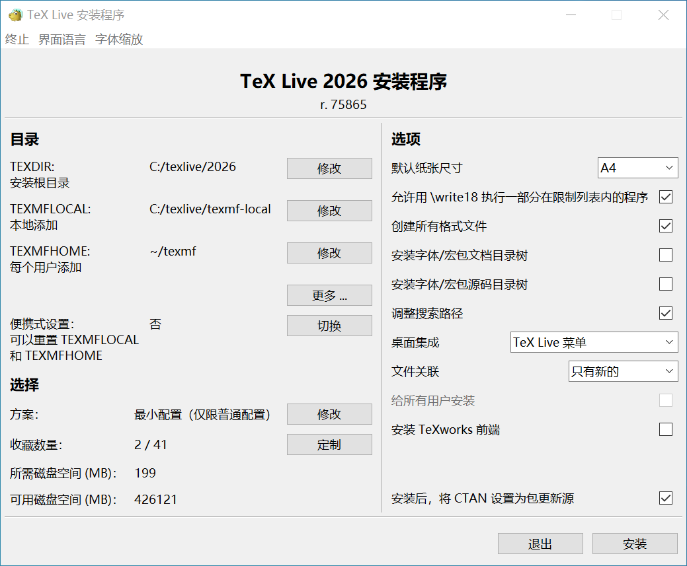
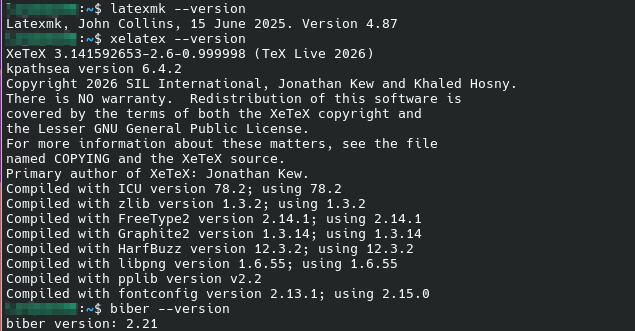

# 🍌 安装 LaTeX 环境

<script setup lang="ts">
import { NCard, NRadioButton, NRadioGroup } from 'naive-ui'
import { computed, ref, watch } from 'vue'

type InstallPlatform = 'windows' | 'linux' | 'macos' | 'wsl'
type InstallMethod = 'full' | 'minimal'

interface Option<T extends string> {
	value: T
	label: string
	disabled?: boolean
}

const installPlatform = ref<InstallPlatform>('windows')
const installMethod = ref<InstallMethod>('full')

const platformOptions: Option<InstallPlatform>[] = [
	{ value: 'windows', label: 'Windows' },
	{ value: 'linux', label: 'Linux' },
	{ value: 'macos', label: 'macOS' },
	{ value: 'wsl', label: 'WSL' },
]

const methodOptions = computed<Option<InstallMethod>[]>(() => [
	{ value: 'full', label: '全量安装' },
	{ value: 'minimal', label: '精简安装', disabled: installPlatform.value === 'wsl' },
])

watch(installPlatform, (platform) => {
	if (platform === 'wsl' && installMethod.value === 'minimal') {
		installMethod.value = 'full'
	}
})
</script>

首先，在使用模板之前，你需要在本机安装 LaTeX 环境。一个完整的 LaTeX 环境包括两部分：

- 开源免费的 LaTeX **发行版**（LaTeX 编译器 + 宏包）
- 以及一个得心应手的 LaTeX **编辑器**

我们在 Windows、macOS 与 Linux 环境中均可以使用 LaTeX 进行文档撰写，该部分主要介绍 LaTeX 的编译环境安装。按照安装方式和操作系统的不同，我们分别进行介绍。

## 安装工作

:::details 🔼 要求 TeX Live 至少 2021，请尽量使用最新版（单击展开详情）

为满足我校要求，BIThesis 实现[[texdoc:biblatex-gb7714-2015|参考文献著录]]、[[texdoc:ctex|章节层次]]等细节时，使用了新版特性，不支持早于 2021 的 TeX Live。

若之前安装过旧版 TeX Live，请按下文安装最新版[^multiple-texlive]，或考虑使用在线平台。

[^multiple-texlive]: 只要自行切换`$PATH`，TeX Live 支持多版本共存，MiKTeX 等其它发行版通常也支持与 TeX Live 共存。

:::

这里的安装教程提供全量安装与精简安装两种方式。本教程以安装 TeX Live 2026 为例进行说明：

- Windows 与 Linux 的全量安装使用 TeX Live ISO 镜像安装或在线安装
- macOS 的全量安装使用 MacTeX 安装
- WSL 的全量安装使用 WSL 2 + ISO 镜像安装
- Windows、Linux 与 macOS 提供精简安装，WSL 暂不提供精简安装

其中，全量安装占用空间较大（约 **8～10GB** ），因此安装前请确保硬盘有足够空间（建议预留 20GB 以上硬盘空间）。如果你的硬盘空间不足，请使用精简安装方式（约 1GB ）进行安装，或是使用在线平台进行写作。

请先选择安装平台，再选择安装方式，以查看对应的安装教程。

---

<n-card>
	<div class="install-selector">
		<div class="selector-group">
			<div class="selector-label"><strong>安装平台：</strong></div>
			<n-radio-group v-model:value="installPlatform">
				<n-radio-button v-for="option in platformOptions" :key="option.value" :value="option.value">
					{{ option.label }}
				</n-radio-button>
			</n-radio-group>
		</div>
		<div class="selector-group">
			<div class="selector-label"><strong>安装方式：</strong></div>
			<n-radio-group v-model:value="installMethod">
				<n-radio-button
					v-for="option in methodOptions"
					:key="option.value"
					:value="option.value"
					:disabled="option.disabled"
				>
					{{ option.label }}
				</n-radio-button>
			</n-radio-group>
		</div>
	</div>
</n-card>

<template v-if="installPlatform === 'windows' && installMethod === 'full'">
<!-- 全量安装-Windows -->

使用北京理工大学校园网的同学可以直接使用我校官方 TeX Live 镜像进行安装。

我校 TeX Live 镜像资源位于 [/CTAN/systems/texlive/Images](https://mirrors.bit.edu.cn/CTAN/systems/texlive/Images/)，其中我们选择下载 `texlive20xx.iso` 即可。

::: warning ❗ 请注意
北理工镜像站仅支持校内访问，因此从非校园网环境访问上面镜像资源将无法打开，如无法连接校园网则可以选用其他的 [CTAN 镜像源](https://mirrors.ctan.org/systems/texlive/Images/)。

另注：安装过程中注意使用合适的权限。
:::


对于 Windows 10 / Windows 11 及以上版本，可以直接挂载 ISO 镜像（双击即可），其余系统用合适的软件也可。之后在打开的文件夹中点击执行 `install-tl-windows.bat` ，一路点击确认，即可离线安装全部 TeX Live 组件。

::::details 也可以在线安装
参考 [Easy install](https://www.tug.org/texlive/windows.html#install)，下载并运行 [`install-tl-windows.exe`](https://mirror.ctan.org/systems/texlive/tlnet/install-tl-windows.exe)，它会在线下载所需文件并安装。

在线安装需要从镜像站拉取 TeX Live 相关文件，因此请确保整个安装过程有稳定的网络环境。

:::warning ❗ 在线安装可能耗时较久甚至失败
由于安装程序是串行地从镜像服务器上下载文件，如果网络环境不佳，或是被分配到了较慢的镜像服务器，可能会导致安装过程非常缓慢，甚至下载失败。因此建议在网络环境较好的情况下使用在线安装，或是直接使用 ISO 镜像进行安装。
:::

::::

即完成了在 Windows 上的 TeX Live 全量安装。
</template>

<template v-if="installPlatform === 'linux' && installMethod === 'full'">
<!-- 全量安装-Linux -->

::: details 💀 谨慎使用系统包管理器安装 { style="border-color: var(--vp-custom-block-warning-border); color: var(--vp-custom-block-warning-text); background-color: var(--vp-custom-block-warning-bg);" }

非滚动发行的发行版（如 Ubuntu 和 Debian 等）的系统包管理器（如 apt）提供的 TeX Live [一般较旧](https://repology.org/project/texlive/versions)（Homebrew 除外），且无法选择安装方案，通常很难使用。

如果坚持使用系统包管理器安装 TeX Live，那以后切勿随意安装、更新或移除宏包。由系统包管理器管理的软件包不应被其他包管理器同时管理，所以采用系统包管理器安装的 TeX Live 不应再使用 tlmgr 管理 TeX 宏包。

:::

使用北京理工大学校园网的同学可以直接使用我校官方 TeX Live 镜像进行安装。

我校 TeX Live 镜像资源位于 [/CTAN/systems/texlive/Images](https://mirrors.bit.edu.cn/CTAN/systems/texlive/Images/)，其中我们选择下载 `texlive20xx.iso` 即可。

::: warning ❗ 请注意
北理工镜像站仅支持校内访问，因此从非校园网环境访问上面镜像资源将无法打开，如无法连接校园网则可以选用其他的 [CTAN 镜像源](https://mirrors.ctan.org/systems/texlive/Images/)。

另注：安装过程中注意使用合适的权限。
:::


首先在系统中挂载 ISO 镜像，使用如下命令：

```bash
sudo mkdir /mnt/texlive # 创建挂载点
sudo mount -o loop /path/to/texlive20xx.iso /mnt/texlive # 挂载 ISO 文件
```

挂载完成后，我们就可以进入挂载目录，运行安装程序来安装 TeX Live 了：

```bash
cd /mnt/texlive
sudo ./install-tl
```

::::details 也可以在线安装
参考 [Quick install](https://www.tug.org/texlive/quickinstall.html)，下载 [`install-tl-unx.tar.gz`](https://mirror.ctan.org/systems/texlive/tlnet/install-tl-unx.tar.gz) 并解压，运行 `install-tl`，它会在线下载所需文件并安装。

在线安装需要从镜像站拉取 TeX Live 相关文件，因此请确保整个安装过程有稳定的网络环境。

:::warning ❗ 在线安装可能耗时较久甚至失败
由于安装程序是串行地从镜像服务器上下载文件，如果网络环境不佳，或是被分配到了较慢的镜像服务器，可能会导致安装过程非常缓慢，甚至下载失败。因此建议在网络环境较好的情况下使用在线安装，或是直接使用 ISO 镜像进行安装。
:::

::::

此时进入 TeX Live 安装界面，我们输入 `I` 来开始安装，等待一段时间后（约 15 分钟），安装程序会提示我们安装完成，我们接下来需要按照安装程序的要求配置环境变量。使用文本编辑器打开 `~/.bashrc` 文件，在文件末尾添加以下内容：

```bash
export PATH=/usr/local/texlive/2026/bin/x86_64-linux:$PATH
export MANPATH=/usr/local/texlive/2026/texmf-dist/doc/man:$MANPATH
export INFOPATH=/usr/local/texlive/2026/texmf-dist/doc/info:$INFOPATH
```

保存并关闭文件后，输入以下命令使环境变量生效：

```bash
source ~/.bashrc
```

::::warning ❗ 字体问题
需要注意的是，部分 Linux 发行版（如 Debian）可能不会预装微软的 Times New Roman 字体，因此需要补装字体（注意此时需要开启 `contrib` 源），即执行如下命令：

```bash
sudo apt install ttf-mscorefonts-installer
```

按照提示确认用户协议后即可完成安装。

同时，在 Linux 上，学校要求使用的中易字库由于版权等历史原因并未预装，因此，BIThesis 会默认使用与相关字体有极小差别的开源字体。当你特别在意这些问题时，请参照 [疑难杂症 - 中文字体如何才能与 Word 模板完全相同？（换用中易字库）](../faq/word-font.md) 进行修正。
::::

即完成在 Linux 上的 TeX Live 全量安装。
</template>

<template v-if="installPlatform === 'macos' && installMethod === 'full'">
<!-- 全量安装-macOS -->

TeX Live 在 macOS 上包装成了 [MacTeX](https://www.tug.org/mactex/)。MacTeX 以 `pkg` 文件发布。我们进入 [MacTeX 的下载页面](https://www.tug.org/mactex/mactex-download.html)，下载完整安装包 `MacTeX.pkg`（大约 6 GB），然后双击运行安装。

使用 Homebrew 包管理的同学，也可以[通过 Homebrew Cask 直接安装 MacTeX](https://formulae.brew.sh/cask/mactex)：

```bash
brew install --cask mactex
```

:::: warning ❗ 字体问题
在 macOS 上，学校要求使用的中易字库由于版权等历史原因并未预装，因此，BIThesis 会默认使用与相关字体有极小差别的开源字体。当你特别在意这些问题时，请参照 [疑难杂症 - 中文字体如何才能与 Word 模板完全相同？（换用中易字库）](../faq/word-font.md) 进行修正。
::::

即完成了在 macOS 上的 TeX Live 全量安装。
</template>

<template v-if="installPlatform === 'wsl' && installMethod === 'full'">
<!-- 全量安装-WSL -->

使用北京理工大学校园网的同学可以直接使用我校官方 TeX Live 镜像进行安装。

我校 TeX Live 镜像资源位于 [/CTAN/systems/texlive/Images](https://mirrors.bit.edu.cn/CTAN/systems/texlive/Images/)，其中我们选择下载 `texlive20xx.iso` 即可。

::: warning ❗ 请注意
北理工镜像站仅支持校内访问，因此从非校园网环境访问上面镜像资源将无法打开，如无法连接校园网则可以选用其他的 [CTAN 镜像源](https://mirrors.ctan.org/systems/texlive/Images/)。

另注：安装过程中注意使用合适的权限。
:::


如果你不知道 WSL，或是不知道如何安装 WSL，可以先参考[WSL 是什么？如何启用 WSL 2？](../faq/enable-wsl2.md)来了解一下。

请将TeX Live ISO 文件下载到 Windows 的某个没有中文路径的目录下（例如本教程中的 `D:\texlive2026.iso`）。

::::danger 🚨 注意你的内存与硬盘容量
WSL 2 默认会使用宿主机的全部内存资源，如果你的电脑内存较小（例如 8GB/16GB），可能会导致 WSL 2 占用过多内存资源，影响系统性能。

同时，WSL 2 的虚拟磁盘默认会占用宿主机的全部硬盘空间（默认在C盘），在安装完 TeX Live 后虚拟磁盘会占用大约 20GB 的硬盘空间，如果你的电脑硬盘空间较小，可能会导致 WSL 2 占用过多硬盘空间，影响系统性能。

推荐有 32GB 及以上内存、30GB 及以上硬盘空间的同学使用 WSL 2 来安装 TeX Live。8GB 内存的同学也可以使用，但建议在安装完成后限制 WSL 2 的内存使用，例如限制为 4GB以避免系统性能问题，或是直接在 Windows 上安装 TeX Live。你可以通过创建或编辑 `.wslconfig` 文件来限制 WSL 2 的内存使用，具体方法请参考 [Microsoft 官方文档](https://docs.microsoft.com/en-us/windows/wsl/wsl-config#configure-global-options-with-wslconfig)。
::::

首先，我们需要将之前下载的 TeX Live ISO 文件挂载到 WSL 2 中。打开 Ubuntu 终端，输入以下命令：

```bash
sudo mkdir /mnt/texlive # 创建挂载点
sudo mount -o loop /mnt/d/texlive2026.iso /mnt/texlive # 挂载 ISO 文件
```

挂载完成后，我们就可以进入挂载目录，运行安装程序来安装 TeX Live 了：

```bash
cd /mnt/texlive
sudo ./install-tl
```

此时进入 TeX Live 安装界面，我们输入 `I` 来开始安装，等待一段时间后（约 15 分钟），安装程序会提示我们安装完成，我们接下来需要按照安装程序的要求配置环境变量。使用文本编辑器打开 `~/.bashrc` 文件，在文件末尾添加以下内容：

```bash
export PATH=/usr/local/texlive/2026/bin/x86_64-linux:$PATH
export MANPATH=/usr/local/texlive/2026/texmf-dist/doc/man:$MANPATH
export INFOPATH=/usr/local/texlive/2026/texmf-dist/doc/info:$INFOPATH
```

保存并关闭文件后，输入以下命令使环境变量生效：

```bash
source ~/.bashrc
```

接下来，我们需要将 Windows 下的字体共享给 WSL 2。首先，在 Windows 中找到字体文件夹，通常位于 `C:\Windows\Fonts`，然后在 Ubuntu 终端中创建一个软链接，并刷新字体缓存即可。具体命令如下：

```bash
sudo mkdir -p /usr/share/fonts/windows
sudo ln -s /mnt/c/Windows/Fonts /usr/share/fonts/windows
sudo fc-cache -fv
```

退出当前目录，卸载 ISO 文件，解除镜像在 WSL 中的挂载：

```bash
cd ~
sudo umount /mnt/texlive
```

即完成了在 WSL 2 中 TeX Live 的全量安装。
</template>

<template v-if="installPlatform === 'windows' && installMethod === 'minimal'">
<!-- 精简安装-Windows -->

精简安装会只安装 BIThesis 必要的宏包，因此占用空间会大幅缩小，仅需 **1GB** 左右的磁盘容量。

::: warning ❗ 注意
由于精简安装过程仅会安装 BIThesis 使用的宏包，因此如果你需要使用其他的 LaTeX 模板包，你需要参照后文的 [日后补充安装](./getting-started.md#日后补充安装) 部分，针对你使用的新模板进行安装。
:::

先下载并运行 [`install-tl-windows.exe`](https://mirror.ctan.org/systems/texlive/tlnet/install-tl-windows.exe)，只是在安装过程中需要修改相关参数，具体步骤如下：

弹出 "TeX Live 安装程序"时，单击 `高级` 按钮。

修改界面内选项如下图：



下载 [BIThesis 所需宏包列表](https://github.com/BITNP/BIThesis/raw/refs/heads/main/.github/tl_packages)，然后打开 PowerShell，用 tlmgr（TeX Live package manager）安装。

```powershell
# 下载 BIThesis 宏包列表（命令行）
curl -LO https://github.com/BITNP/BIThesis/raw/refs/heads/main/.github/tl_packages
# 需注意在 PowerShell 中 curl 是 Invoke-WebRequest 的别名
# 因此在 PowerShell 中使用 curl 实际上是调用 Invoke-WebRequest，需按下面写法来
# 下载 BIThesis 宏包列表（PowerShell）
Invoke-WebRequest -Uri "https://github.com/BITNP/BIThesis/raw/refs/heads/main/.github/tl_packages" -OutFile "tl_packages"

tlmgr update --self # 更新 tlmgr 自身（TeX Live 中的 tlmgr 版本较旧，更新后才能安装新版宏包）
tlmgr install ((Get-Content ./tl_packages) -replace '\s*#.*', '') # 安装 BIThesis 所需宏包
```

即完成了在 Windows 上的 TeX Live 精简安装。
</template>

<template v-if="installPlatform === 'linux' && installMethod === 'minimal'">
<!-- 精简安装-Linux -->

精简安装会只安装 BIThesis 必要的宏包，因此占用空间会大幅缩小，仅需 **1GB** 左右的磁盘容量。

::: warning ❗ 注意
由于精简安装过程仅会安装 BIThesis 使用的宏包，因此如果你需要使用其他的 LaTeX 模板包，你需要参照后文的 [日后补充安装](./getting-started.md#日后补充安装) 部分，针对你使用的新模板进行安装。
:::

下载 [`install-tl-unx.tar.gz`](https://mirror.ctan.org/systems/texlive/tlnet/install-tl-unx.tar.gz) 并解压，使用如下命令运行 `install-tl`，并按 `I` 安装。（这里将安装目录从默认`/usr/local/texlive/`改为了`~/.texlive/`，因为前者可能需要 sudo）：

```bash
mkdir ~/.texlive/
./install-tl --texdir=~/.texlive --scheme=scheme-minimal --no-doc-install --no-src-install
```

我们接下来需要按照安装程序的要求配置环境变量。使用文本编辑器打开 `~/.bashrc` 文件，在文件末尾添加以下内容：

```bash
export PATH=~/.texlive/2026/bin/x86_64-linux:$PATH
export MANPATH=~/.texlive/2026/texmf-dist/doc/man:$MANPATH
export INFOPATH=~/.texlive/2026/texmf-dist/doc/info:$INFOPATH
```

保存并关闭文件后，输入以下命令使环境变量生效：

```bash
source ~/.bashrc
```

这样就会得到一个只有基础宏包的 LaTeX 编译环境，接下来下载 [BIThesis 所需宏包列表](https://github.com/BITNP/BIThesis/raw/refs/heads/main/.github/tl_packages)，然后用 tlmgr（TeX Live package manager）安装，具体命令如下：

```bash
curl -LO https://github.com/BITNP/BIThesis/raw/refs/heads/main/.github/tl_packages
# 下载 BIThesis 宏包列表
tlmgr update --self # 更新 tlmgr 自身（TeX Live 中的 tlmgr 版本较旧，更新后才能安装新版宏包）
tlmgr install $(sed -E 's/#.*//' ./tl_packages) # 安装 BIThesis 所需宏包
```

::::warning ❗ 字体问题
需要注意的是，部分 Linux 发行版（如 Debian）可能不会预装微软的 Times New Roman 字体，因此需要补装字体（注意此时需要开启 `contrib` 源），即执行如下命令：

```bash
sudo apt install ttf-mscorefonts-installer
```

按照提示确认用户协议后即可完成安装。

同时，在 Linux 上，学校要求使用的中易字库由于版权等历史原因并未预装，因此，BIThesis 会默认使用与相关字体有极小差别的开源字体。当你特别在意这些问题时，请参照 [疑难杂症 - 中文字体如何才能与 Word 模板完全相同？（换用中易字库）](../faq/word-font.md) 进行修正。
::::

即完成了在 Linux 上的 TeX Live 精简安装。
</template>

<template v-if="installPlatform === 'macos' && installMethod === 'minimal'">
<!-- 精简安装-macOS -->

精简安装会只安装 BIThesis 必要的宏包，因此占用空间会大幅缩小，仅需 **1GB** 左右的磁盘容量。

::: warning ❗ 注意
由于精简安装过程仅会安装 BIThesis 使用的宏包，因此如果你需要使用其他的 LaTeX 模板包，你需要参照后文的 [日后补充安装](./getting-started.md#日后补充安装) 部分，针对你使用的新模板进行安装。
:::

前往 [More Packages - MacTeX](https://www.tug.org/mactex/beginners.html)，下载[`BasicTeX.pkg`](https://mirror.ctan.org/systems/mac/mactex/BasicTeX.pkg)（一两百 MB）并运行，这会安装基础设施和基本宏包。

下载 [BIThesis 所需宏包列表](https://github.com/BITNP/BIThesis/raw/refs/heads/main/.github/tl_packages)，然后用 tlmgr（TeX Live package manager）安装。

```shell
curl -LO https://github.com/BITNP/BIThesis/raw/refs/heads/main/.github/tl_packages
# 下载 BIThesis 宏包列表
sudo tlmgr update --self # 更新 tlmgr 自身（BasicTeX 中的 tlmgr 版本较旧，更新后才能安装新版宏包）
sudo tlmgr install $(sed -E 's/#.*//' ./tl_packages) # 安装 BIThesis 所需宏包
```

:::: warning ❗ 字体问题
在 macOS 上，学校要求使用的中易字库由于版权等历史原因并未预装，因此，BIThesis 会默认使用与相关字体有极小差别的开源字体。当你特别在意这些问题时，请参照 [疑难杂症 - 中文字体如何才能与 Word 模板完全相同？（换用中易字库）](../faq/word-font.md) 进行修正。
::::

即完成了在 macOS 上的 TeX Live 精简安装。
</template>

<template v-if="installMethod === 'minimal'">

:::: tip 日后补充安装 {#日后补充安装}

::: details 📦 补充宏包

若用别的宏包时遇到 File not found 错误，可按需[使用 tlmgr 补装](./commands.md#tlmgr)，例如：

```shell
$ latexmk
…
! LaTeX Error: File `upquote.sty' not found.
Type X to quit …
👆 发现缺失 upquote.sty，先输入“X”中止编译

👇 然后补装 https://ctan.org/pkg/upquote
$ tlmgr install upquote
…
```

:::

::: details 📖 补充本地宏包手册

以上“精简”了本地宏包手册，一般用 [texdoc 在线版](https://texdoc.org) 替代即可。

若希望在 TeX Live 安装目录保存宏包手册，可指定`--with-doc`，例如：

```shell
# 新装宏包并保存文档（若已装过，会放弃并提示 package already present）
tlmgr install --with-doc minted algorithm2e …

# 重装已有宏包，并补充文档
tlmgr install --reinstall --with-doc --no-depends ctex biblatex-gb7714-2015 …
```

::::

</template>

## 确认安装

为了保证我们 LaTeX 发行版的安装没有问题，我们需要验证一下 LaTeX 编译工具的安装情况。我们打开终端（Windows 打开 PowerShell、macOS 打开 Terminal、Linux 打开你所使用的终端模拟器），在其中输入下面的命令：

```bash
latexmk --version # 验证 latexmk 的安装
xelatex --version # 验证 xelatex 的安装
biber --version #验证 biber 的安装
```



出现类似的输出，说明我们编译器安装应该是没有问题的。

准备就绪后，我们还需要选择一个趁手的编辑器，请转到 [📁 编辑器配置](./configure-and-compile.md) 页面进行进一步的操作。

<style scoped>
.install-selector {
	display: flex;
	flex-wrap: wrap;
	gap: 1.5rem;
	align-items: center;
}

.selector-group {
	display: flex;
	align-items: center;
	gap: 0.75rem;
	flex-wrap: wrap;
}

.selector-label {
	flex-shrink: 0;
}

@media (max-width: 768px) {
	.install-selector {
		flex-direction: column;
		align-items: flex-start;
	}
}
</style>
