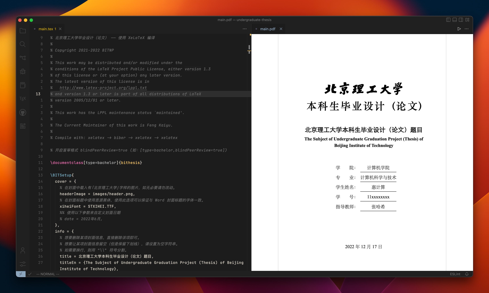

# 教程简介

<!-- ## Q：我该如何学习使用 BIThesis？

A：有以下**两种选择**。无论哪种，都几乎涵盖了使用 BIThesis 所需的编译环境和基础知识，请大家放心食用。

1. 「**快速使用指南**」（[本科][undergraduate-handbook]／[硕博][graduate-handbook]）
   - 面向没有太多计算机基础的同学
   - 附图的 PDF

2. 「**食用方法**」（本站后续页面）
   - 面向有一定计算机基础的同学
   - 一系列网页
   - 详细介绍各种情况的使用方法和注意事项 -->

BIThesis 为使用者提供了两种学习方式，一种是在线的 PDF 「**快速使用指南**」，另一种则是本网站的后续部分 「**食用方法**」。

<aside hidden>
此外也可直接前往「[系列视频指导](../video/intro.md)」，根据视频的介绍进行学习使用。（录制于 2020 年，与目前的模板使用方式有些许出入；仅供参考）——你好，考古学家！
</aside>

## 快速使用指南

快速使用指南为面向初学者、没有太多计算机基础的同学而编写的一份附图 PDF 文档，该文档涵盖了使用 BIThesis 的基础知识，能够较为直观、快速地上手 BIThesis。

快速使用指南提供 [本科][undergraduate-handbook] 与 [硕博][graduate-handbook] 两个版本，点击即可打开相应界面。

阅读完毕即可开始写作。到时有需要再进一步参考[详细配置手册`bithesis.pdf`][bithesis-pdf]，该手册会随着模板包一同发布。

[bithesis-pdf]: https://mirrors.ctan.org/macros/unicodetex/latex/bithesis/bithesis.pdf
[undergraduate-handbook]: https://mirrors.ctan.org/macros/unicodetex/latex/bithesis/bithesis-handbook-undergraduate.pdf
[graduate-handbook]: https://mirrors.ctan.org/macros/unicodetex/latex/bithesis/bithesis-handbook-graduate.pdf

## 食用方法

食用方法为该网站的后续网页，目前包含 LaTeX 环境安装、编辑器配置、模板下载与使用三部分，未来会提供一份详细的 LaTeX 学习指导手册。

下图展示了 LaTeX 典型写作环境。编辑**文本文件**（左半图以`.tex`结尾的文件），让编辑器**调用**一些**工具**，生成 PDF（右半图本科毕业设计封面）。

配置 BIThesis 的方法相应分为三步：

1. [🍌 LaTeX 环境安装](./getting-started.md)——下载并安装这些**工具**
2. [📃 编辑器配置](./configure-ide.md)——告知编辑器如何**调用**工具
3. [📁 模板下载与使用](./using-templates.md)——下载 BIThesis 提供的**文本文件**

完成三步后，应该就能开始写作了。

不过注意写作需按 LaTeX **语法**编辑文本文件。如您之前未接触过，可参考 [上方《快速使用指南》](#快速使用指南)的第3章与第4章或本站 [👩‍🏫 LaTeX 学习与使用资源](./resources.md)。

:::warning ✋ 遇到问题？{#help}

如果遇到问题，你可以——

1. 搜索本站 [🥑 疑难杂症](../faq/)（搜索栏在页面上方）
2. 查询互联网及 [🤖 人工智能](./ask-computer.md)
3. 询问同学，可加入 [🐧 QQ 群：737548118](https://jq.qq.com/?_wv=1027&k=KYDrmS5z)

:::
